# LLM Orchestration Framework

---

## Table of Contents

[Protocols](<#1.0 protocols>)
  - [P00: Governance (start here)](<#1.1 p00 governance (start here)>)
  - [P01: Project Initialization (Execute once)](<#1.2 p01 project initialization (execute once)>)
  - [P02: Design](<#1.3 p02 design>)
  - [P03: Change](<#1.4 p03 change>)
  - [P04: Issue](<#1.5 p04 issue>)
  - [P05: Trace](<#1.6 p05 trace>)
  - [P06: Test](<#1.7 p06 test>)
  - [P07: Quality](<#1.8 p07 quality>)
  - [P08: Audit](<#1.9 p08 audit>)
  - [P09: Prompt](<#1.10 p09 prompt>)
  
[Templates](<#2.0 templates>)
  - [T01: Design](<#2.1 t01 design>)
  - [T02: Change](<#2.2 t02 change>)
  - [T03: Issue](<#2.3 t03 issue>)
  - [T04: Prompt](<#2.4 t04 prompt>)
  - [T05: Test](<#2.5 t05 test>)
  - [T06: Result](<#2.6 t06 result>)
  
[Workflow](<#3.0 workflow>)

[Version History](<#version history>)

---
###### Governance Prime directive: Follow workflow [flowchart](<#3.0 framework execution flowchart>)
---
## 1.0 Protocols (Directives)

#### 1.1 P00 Governance (start here)

  - 1.1.1 Purpose
    - Python based software engineering, architecture and development
  - 1.1.2 Scope
    - Agnostic plan, control and initiation of software generation
  - 1.1.3 Framework Practice
    - This governance framework defines software development processes and workflows
    - Claude Desktop/Claude Code separation applies to software creation, not to generated application runtime
    - Generated software/applications (outputs) are independent of framework architecture
    - Framework controls: how we build software
    - Framework does not control: how the built software operates
    - Example: \<project name\> uses this framework for development but is a standalone Python application at runtime
  - 1.1.4 Architecture
    - Claude Desktop (domain 1): Plan and control: design, change, test and launching of code generation
    - Claude Code (domain 2): Execute: code generation
  - 1.1.5 Forbidden
    - Both domains: Unrequested creation, addition, removal or change of source code and documents is forbidden
  - 1.1.6 Constraints
    - Claude Desktop: Does not exceed language model context resource budget when communicating with Claude Code
  - 1.1.7 Control
    - Claude Desktop: Strategic coordination and validation authority
    - Claude Desktop: Analyzes requirements and formulates design specifications
    - Claude Desktop: Creates T04 prompts with complete technical context
    - Claude Desktop: Validates Claude Code implementation for protocol compliance
    - Claude Desktop: Coordinates quality assurance and integration verification
    - Claude Code: Tactical implementation with project awareness
    - Claude Code: Generates source code with MCP filesystem access
    - Claude Code: Performs direct file operations in src/ directory
    - Claude Code: Validates protocol compliance through direct file access
    - Claude Code: Coordinates multi-file implementations and dependencies

  - 1.1.8 Communication
    - Both Claude Desktop and Claude Code have MCP filesystem access to project
    - Communication uses filesystem-based message passing (semaphores)
    - Claude Desktop: Uses template [T04 Prompt](<#2.4 t04 prompt>) to create code generation or debug prompts for Claude Code
    - Claude Desktop: Embeds complete Tier 3 component design specifications and schema within prompt documents
    - Claude Desktop: Ensures prompt documents are self-contained requiring no external file references
    - Claude Desktop: Saves T04 prompt to workspace/prompt/prompt-NNNN-\<name\>.md
    - Claude Desktop: Provides ready-to-execute command in conversation after human approval
    - Human: Executes provided command to invoke Claude Code with T04 prompt
    - Claude Code: Reads T04 prompt from workspace/prompt/
    - Claude Code: Analyzes project structure and existing code via MCP filesystem access
    - Claude Code: Generates code, saves directly to src/ per T04 specifications
    - Human: Notifies Claude Desktop when code generation complete
    - Claude Desktop: Reviews generated code, proceeds with audit
  - 1.1.9 Quality
    - Human review and approval of design, change and initiation of code generation is required
    - Claude Desktop: Provides ready-to-execute command after human approval
    - Human: Invokes Claude Code with provided command
    - Human: Notifies Claude Desktop when Claude Code completes
    - Claude Desktop: Reviews generated code before proceeding
  - 1.1.10 Documents
    - Master documents have '0000' as a sequence number and are named as \<document class\>-0000-master_\<document name\>.md
    - Claude Desktop: Based on document class (design, change, issue, proposal, prompt, trace, test, result, audit) adds a sequentially contiguous \<sequence number\> starting at 0001 to all created documents
    - Claude Desktop: Based on document class (design, change, issue, proposal, prompt, trace, test, result, audit) follows naming format \<document class\>-\<sequence number\>-\<document name\>.md when creating documents
    - Claude Desktop: Design documents follow tier naming convention: master_, domain_, component_ prefixes
    - Claude Desktop: Insures related documents are Obsidian cross linked
    - Document classes that require a master document are: design, audit, trace and test
    - All document classes (issue, change, prompt, test, result) contain internal iteration field starting at 1
    - Iteration increments when document enters new cycle after failed verification
    - Git commit required after iteration field modification
    - Filesystem contains only current iteration; GitHub history preserves prior iterations
    - Coupled documents share sequence number and maintain synchronized iteration numbers
  - 1.1.11 Configuration Management
    - GitHub repository is authoritative source for all project artifacts
    - Human: Tags design document commits when approved as baseline for code generation via GitHub Desktop (History → right-click commit → Create Tag → Push Tags)
    - Claude Desktop: Performs configuration audit verifying generated code matches approved design baseline commits
    - Claude Desktop: Uses config-audit template from workspace/audit/config-audit-template.md
    - Claude Desktop: Verifies code matches tagged design baseline specifications
    - Claude Desktop: Documents findings in config-audit-NNNN-YYYY-MM-DD.md
    - Claude Desktop: Stores configuration audits in workspace/audit/
    - Critical deviations: Creates issues via P04 for remediation
  - 1.1.12 Versioning
    - All versioning is handled via GitHub
    - Project uses Semantic Versioning per https://semver.org
    - Format: MAJOR.MINOR.PATCH (e.g., 1.0.0, 1.2.3)
    - MAJOR: Incompatible API changes or major functionality changes
    - MINOR: Backwards-compatible functionality additions
    - PATCH: Backwards-compatible bug fixes
    - Pre-release versions: MAJOR.MINOR.PATCH-alpha.N, -beta.N, -rc.N (e.g., 1.0.0-alpha.1)
    - Initial development: 0.y.z (MAJOR version zero for initial development)
    - Git tags format: vMAJOR.MINOR.PATCH (e.g., v1.0.0, v0.1.0)
    - Release notes filename: RELEASE_NOTES_vMAJOR.MINOR.PATCH.md
  - 1.1.13 Document Lifecycle Management
    - 1.1.13.1 Active State
      - Active documents reside in workspace/\<class\>/
      - Active documents are mutable during iteration cycles
      - Iteration field increments with each debug/refinement cycle
      - Git commit required after each iteration increment
    - 1.1.13.2 Closed State
      - Upon human acceptance, documents moved to workspace/\<class\>/closed/
      - Closed documents are immutable
      - Closed documents preserve final iteration number
      - Access: Read-only reference for future work
    - 1.1.13.3 Closure Criteria
      - Issue: Resolved and verified, corresponding change implemented and tested
      - Change: Implemented, tested, design updated, human accepted
      - Prompt: Code generated successfully, human confirmed
      - Test: Executed with passing results, result document created
      - Result: Tests passed, no issues created, acceptance confirmed
      - Audit: All critical findings resolved, high-priority findings addressed or mitigated, human approved
    - 1.1.13.4 Archival Procedure
      - Human initiates closure after acceptance
      - Claude Desktop verifies closure criteria met
      - Claude Desktop moves coupled document set to respective closed/ subfolders
      - Git commit records closure transition
      - Closed documents referenced but not modified
    - 1.1.13.5 Closed Subfolder Structure
      - workspace/issue/closed/
      - workspace/change/closed/
      - workspace/prompt/closed/
      - workspace/audit/closed/
      - workspace/test/closed/
      - workspace/test/result/closed/
    - 1.1.13.6 Access Constraints
      - Closed documents: Read-only access for reference
      - No modifications permitted to closed documents
      - New work requires new document with new sequence number
      - Reopening closed work: Create new issue referencing closed documents
  - 1.1.14 Logging Standards
    - Generated applications implement environment-based log level control
    - Debug mode enables verbose logging for development and testing
    - Normal mode restricts logging to informational events only
    - Flat file format recommended: timestamp level logger message
    - Centralized log location per application requirements
    - Log rotation policy prevents disk exhaustion
    - Test environments use debug mode for comprehensive logging
    - Production environments use normal mode for operational efficiency
    - Log artifacts preserved for failure analysis
  - 1.1.15 Knowledge Base
    - Claude Desktop: Consults workspace/knowledge/ before creating documents or code
    - Claude Code: Consults workspace/knowledge/ before implementing changes
    - Both domains: Add newly discovered patterns and solutions to knowledge base
    - Knowledge documents contain: problem statements, solutions, examples, rationale
    - Knowledge base prevents repeated problem-solving across development cycles
  - 1.1.16 Logging Standards
    - Generated applications implement environment-based log level control
    - Debug mode enables verbose logging for development and testing
    - Normal mode restricts logging to informational events only
    - Flat file format recommended: timestamp level logger message
    - Centralized log location per application requirements
    - Log rotation policy prevents disk exhaustion
    - Test environments use debug mode for comprehensive logging
    - Production environments use normal mode for operational efficiency
    - Log artifacts preserved for failure analysis

[Return to Table of Contents](<#table of contents>)

#### 1.2 P01 Project Initialization (Execute once)
  - 1.2.1 Project folders
    - Create (see 1.2.6 Project folder structure)
  - 1.2.2 GitHub documents
    - Create .gitignore in project root:
```
.DS_Store
**/.DS_Store
.obsidian/
*.log
**/*.log
10000
**/logs
.zsh_history
coverage.xml
test.txt
**/tmp
deprecated/
workspace/admin/
workspace/ai/
workspace/proposal/
workspace/proposal/closed
venv/
.venv/
*.pyc
__pycache__/
.pytest_cache/
dist/
build/
*.egg-info/
```

  - 1.2.3 README
    - Create initial skeleton 'README.md' document in each folder
  - 1.2.4 Copy this document (governance.md) from ˜/Documents/GitHub/LLM-Governance-and-Orchestration into \<project name>/ai
  - 1.2.5 Traceability Matrix
     - Create skeleton trace-0000-master_traceability-matrix.md in workspace/trace/
  - 1.2.6 Project folder structure
    - Layout
```
    └── <project name>/
        ├── ai/                       # Operational rules
        │   └── governance.md
        ├── venv/                     # Python virtual environment (excluded from git)
        ├── dist/                     # Python build artefacts (excluded from git)
        ├── workspace/                # Execution space
        │   ├── admin/                # Administrative reports (excluded from git)
        │   ├── design/
        │   ├── change/
        │   │   └── closed/
        │   ├── knowledge/            # Institutional knowledge
        │   ├── issues/
        │   │   └── closed/
        │   ├── proposal/             # (excluded from git)
        │   │   └── closed/
        │   ├── prompt/
        │   │   └── closed/
        │   ├── trace/
        │   ├── audit/
        │   │   └── closed/
        │   ├── test/
        │   │   ├── closed/
        │   │   └── result/
        │   │       └── closed/
        │   └── ai/                   # Optional: (excluded from git)
        ├── docs/                     # Technical Documents
        ├── src/                      # Source code
        │   └── tests/
        └── deprecated/               # Archive (excluded from git)
```

  - 1.2.7 Python Virtual Environment Setup (Human executes)
    - Human: virtual environment setup instructions for when project initialization completes
```
# Create virtual environment in project root
cd <project name>

python3 -m venv venv

# Activate virtual environment
source venv/bin/activate

# Install project dependencies
pip install -e .[dev]

# Verify installation
pip list
```
  - 1.2.8 Python documents
    - Create pyproject.toml in project root:
```
[project]
name = "\<project-name\>"
version = "0.1.0"
description = "<project description>"
authors = [{name = "<author name>"}]
license = {text = "MIT"}
requires-python = ">=3.9"
dependencies = [
]

[project.optional-dependencies]
dev = [
    "pytest>=7.0.0",
    "pytest-asyncio>=0.21.0",
    "pytest-cov>=4.0.0",
]

[build-system]
requires = ["setuptools>=61.0"]
build-backend = "setuptools.build_meta"

[tool.pytest.ini_options]
asyncio_mode = "auto"
testpaths = ["tests"]
python_files = ["test_*.py"]
python_classes = ["Test*"]
python_functions = ["test_*"]

[tool.coverage.run]
source = ["src"]
omit = ["*/tests/*"]

[tool.coverage.report]
exclude_lines = [
    "pragma: no cover",
    "def __repr__",
    "raise AssertionError",
    "raise NotImplementedError",
]
```

[Return to Table of Contents](<#table of contents>)

#### 1.3 P02 Design
  - 1.3.1 Tier 1: System Architecture
    - Claude Desktop: Creates design-0000-master_\<project\>.md from human requirements using template [T01 Design](<#2.1 t01 design>)
    - Claude Desktop: Defines system architecture, technology stack, cross-cutting concerns
    - Claude Desktop: Includes system-level Mermaid diagrams (architecture, component interaction, state machine, data flow)
    - Claude Desktop: Clearly designates document as master design within document content
  - 1.3.2 Tier 1 Review
    - Claude Desktop: Presents master design document for human approval
    - Claude Desktop: Documents review findings, required changes, approval decision
    - Claude Desktop: Proceeds with Tier 2 decomposition only after approval recorded
  - 1.3.3 Tier 2: Domain Decomposition
    - Claude Desktop: Decomposes master into functional domains using template [T01 Design](<#2.1 t01 design>)
    - Claude Desktop: Creates design-NNNN-domain_\<name\>.md for each domain with contiguous sequence numbers (0001, 0002, etc.)
    - Claude Desktop: Each domain defines: boundaries, interfaces, domain patterns, responsibilities
    - Claude Desktop: Includes domain-level Mermaid diagrams as needed
  - 1.3.4 Tier 2 Review
    - Claude Desktop: Presents domain design documents for human approval
    - Claude Desktop: Documents review findings, required changes, approval decision
    - Claude Desktop: Proceeds with Tier 3 decomposition only after approval recorded
  - 1.3.5 Tier 3: Component Decomposition
    - Claude Desktop: Decomposes each domain into components using template [T01 Design](<#2.1 t01 design>)
    - Claude Desktop: Creates design-NNNN-component_\<domain\>_\<name\>.md for each component
    - Claude Desktop: Component shares parent domain's sequence number
    - Claude Desktop: Each component defines: implementation details, interfaces, processing logic, error handling
    - Claude Desktop: Includes component-level Mermaid diagrams as needed
  - 1.3.6 Tier 3 Review
    - Claude Desktop: Presents component design documents for human approval
    - Claude Desktop: Documents review findings, required changes, approval decision
    - Claude Desktop: Proceeds with T04 prompt creation only after approval recorded
  - 1.3.7 Design Hierarchy Naming Convention
    - Tier 1: design-0000-master_\<project\>.md (single master document)
    - Tier 2: design-NNNN-domain_\<name\>.md (one per domain, contiguous sequence)
    - Tier 3: design-NNNN-component_\<domain\>_\<name\>.md (shares domain sequence number)
  - 1.3.8 Cross-Linking Requirements
    - Claude Desktop: Master lists all Tier 2 domain document references
    - Claude Desktop: Each domain lists: master parent reference, all Tier 3 component children references
    - Claude Desktop: Each component lists: domain parent reference, generated code file paths
    - Claude Desktop: Uses Obsidian internal link syntax for all cross-references
  - 1.3.9 Context Window Constraints
    - Claude Desktop: Ensures design documents at each tier do not exceed Claude Code context window
    - Claude Desktop: T04 prompts embed only Tier 3 component designs relevant to code generation task
  - 1.3.10 Design Verification
    - Claude Desktop: Validates design completeness at each tier before proceeding to next tier
    - Claude Desktop: Verifies all functional requirements have corresponding design coverage
    - Claude Desktop: Confirms all non-functional requirements addressed across design hierarchy
  - 1.3.11 Requirements Traceability
    - Claude Desktop: Assigns unique identifier to each functional and non-functional requirement
    - Claude Desktop: Maps requirements through design tiers: requirement → master → domain → component
    - Claude Desktop: Maintains bidirectional links in traceability matrix
  - 1.3.12 Requirements Validation
    - Claude Desktop: Verifies design hierarchy satisfies all stated requirements before baseline
    - Claude Desktop: Documents validation results in master design document
    - Claude Desktop: Resolves discrepancies before proceeding to code generation
  - 1.3.13 Document Storage
    - Claude Desktop: Saves all design documents in workspace/design
  - 1.3.14 Visual Documentation Requirements
    - Claude Desktop: Embeds Mermaid diagrams directly within design documents at all tiers
    - Tier 1 Master: System architecture, overall component relationships, system-level state machines
    - Tier 2 Domain: Domain boundaries, domain internal structure, domain interfaces
    - Tier 3 Component: Component-specific flows, detailed state machines, data transformations
    - Claude Desktop: All diagrams use Mermaid syntax within markdown code blocks
    - Claude Desktop: Each diagram includes: purpose statement, legend, cross-references
    - Claude Desktop: Updates diagrams when design modifications require visual clarification
    - Claude Desktop: Maintains diagram consistency with textual design specifications

[Return to Table of Contents](<#table of contents>)

#### 1.4 P03 Change
  - 1.4.1 Change document creation
    - Claude Desktop: Creates change documents exclusively from issue documents using template [T02 Change](<#2.2 t02 change>) and saves them in folder workspace/change
    - Claude Desktop: For human-requested source code changes, first creates issue document via P04, then creates change document referencing that issue
    - Exception: Non-source-code changes (workspace/ documents per 1.4.10) may be implemented directly after human approval without issue/change documents
  - 1.4.2 Document coupling
    - Claude Desktop: Ensures one-to-one coupling between issue and change documents
    - Claude Desktop: Every source code change document must reference exactly one source issue document
    - Claude Desktop: Every resolved source code issue must reference exactly one change document
    - Claude Desktop: Prohibits multiple change documents addressing same issue or multiple issues addressed by same change
    - Claude Desktop: Change sequence number matches source issue sequence number
    - Claude Desktop: Change iteration number matches source issue iteration number at creation
    - Claude Desktop: When issue iteration increments, corresponding change iteration increments synchronously
    - Claude Desktop: Verifies iteration synchronization before workflow transitions
  - 1.4.3 Design document updates
    - Claude Desktop: Updates all relevant design documents after implementation
  - 1.4.4 Design document cross-linking
    - Claude Desktop: Insures all design document updates contain change references and links to their source change document
  - 1.4.5 Change Review
    - Claude Desktop: Performs impact analysis before change approval
    - Claude Desktop: Evaluates effects on dependent components, interfaces, data structures
    - Claude Desktop: Documents impact analysis results in change document
  - 1.4.6 Requirements Change Management
    - Claude Desktop: Links requirement changes to affected design elements
    - Claude Desktop: Performs impact analysis when requirements change
    - Claude Desktop: Updates requirement traceability matrix after changes
  - 1.4.7 Maintenance Classification
    - Claude Desktop: Categorizes changes: corrective, adaptive, perfective, preventive
    - Claude Desktop: Records classification in change document metadata
    - Claude Desktop: Tracks change type distribution for process metrics
  - 1.4.8 Change Impact Analysis
    - Claude Desktop: Evaluates change effects on system integrity, performance, security
    - Claude Desktop: Identifies all components requiring modification
    - Claude Desktop: Documents cascading effects in change document
  - 1.4.9 Maintenance Documentation
    - Claude Desktop: Updates all affected documentation when changes implemented
    - Claude Desktop: Maintains documentation currency with code state
    - Claude Desktop: Cross-links updated documents to source change document
  - 1.4.10 Documentation domain
    - Change documentation is only required for source code changes in src/. Change documentation to documents in the workspace/ is not required and can be made directly after human approval.

[Return to Table of Contents](<#table of contents>)

#### 1.5 P04 Issue
  - 1.5.1 Issue creation from test results
    - Claude Desktop: Creates issue documents from errors reported in workspace/test/result using template [T03 Issue](<#2.3 t03 issue>) and saves them in folder workspace/issue
  - 1.5.2 Reserved for future use
    - Claude Desktop: Reserved for future use
  - 1.5.3 Debug workflow
    - Claude Code: Debugs issues submitted from Claude Code and returns change proposal to Claude Desktop
  - 1.5.4 Issue updates
    - Claude Desktop: Updates issue documents from bugs and  using template [T03 Issue](<#2.3 t03 issue>) and saves them in folder workspace/issue
  - 1.5.5 Non-Conformance Reporting
    - Claude Desktop: Documents instances where generated code deviates from design specifications
    - Claude Desktop: Records deviation type, severity, affected components
    - Claude Desktop: Tracks non-conformance trends for process improvement
  - 1.5.6 Post-Implementation Review
    - Claude Desktop: Evaluates code generation effectiveness after issue resolution
    - Claude Desktop: Documents lessons learned
    - Claude Desktop: Provides protocol improvement recommendations for human review (protocols immutable, human-modified only)
  - 1.5.7 Issue-Change Coupling
    - Claude Desktop: Updates issue document with change_ref field when change created
    - Claude Desktop: Sets issue status to "resolved" when corresponding change status becomes "implemented"
    - Claude Desktop: Verifies bidirectional linkage exists: issue.change_ref ↔ change.source.reference
    - Claude Desktop: Prevents issue closure without corresponding change document for source code issues
    - Claude Desktop: issue.iteration must equal change.iteration throughout cycle
    - Claude Desktop: When debugging requires new iteration, both documents increment together
    - Claude Desktop: Git commit captures synchronized iteration state
    - Claude Desktop: Validates iteration match before proceeding
    - Note: One-to-one coupling does not prevent modification of paired issue/change documents during debugging iterations

[Return to Table of Contents](<#table of contents>)

#### 1.6 P05 Trace
  - 1.6.1 Traceability Matrix Management
    - Claude Desktop: Maintains traceability matrix in workspace/trace/trace-0000_master-traceability-matrix.md
    - Claude Desktop: Updates matrix when requirements, designs, code, or tests modified
  - 1.6.2 Traceability Verification
    - Claude Desktop: Verifies bidirectional links exist: requirements ↔ design ↔ code ↔ test (navigable forward and backward)
    - Claude Desktop: Identifies and resolves traceability gaps
    - Claude Desktop: Generates traceability reports on demand
  - 1.6.3 Requirements Traceability
    - Claude Desktop: Maintains traceability matrix linking requirements through implementation
    - Claude Desktop: Updates matrix when designs, code, or tests modified
    - Claude Desktop: Ensures orphaned requirements or implementations identified
  - 1.6.4 Traceability Matrix Structure
    - Claude Desktop: Maintains single traceability matrix in workspace/trace/trace-0000-master_traceability-matrix.md
    - Required sections:
      - Functional Requirements: ID, Requirement, Design, Code, Test, Status
      - Non-Functional Requirements: ID, Requirement, Target, Design, Code, Test, Status
      - Component Mapping: Component → Requirements → Design → Source → Test
      - Design Document Cross-Reference: Design Doc → Requirements → Code → Tests
      - Test Coverage: Test File → Requirements Verified → Code Coverage
      - Bidirectional Navigation: Forward (Req→Design→Code→Test) and Backward (Test→Code→Design→Req)
    - Claude Desktop: Updates matrix when requirements, designs, code, or tests change

[Return to Table of Contents](<#table of contents>)

#### 1.7 P06 Test
  - 1.7.1 Purpose
  - 1.7.2 Test documentation
    - Claude Desktop: Creates test documents from source code generated by Claude Code using template [T05 Test](<#2.5 t05 test>) and saves them in folder workspace/test
  - 1.7.3 Test Script Creation
    - Claude Desktop: Generates executable test scripts in src/tests/
    - Claude Desktop: Creates unit tests for components in subdirectories (src/tests/\<component\>/)
    - Claude Desktop: Uses pytest or unittest framework per pyproject.toml configuration
    - Claude Desktop: Names test files with test_*.py convention
    - Claude Desktop: Links test scripts to test documentation via T05 references
  - 1.7.4 Test Planning
    - Claude Desktop: Creates comprehensive test strategy before code generation
    - Claude Desktop: Defines test scope, approach, resources, schedule
    - Claude Desktop: Identifies test types: unit, integration, system, acceptance
  - 1.7.5 Test Case Specification
    - Claude Desktop: Structures test cases: preconditions, inputs, expected outputs, postconditions
    - Claude Desktop: Links test cases to requirements and design elements
    - Claude Desktop: Includes positive, negative, boundary, edge cases
  - 1.7.6 Test Results Documentation
    - Claude Desktop: Records test execution results in standardized format
    - Claude Desktop: Captures: pass/fail status, defects found, coverage achieved
    - Claude Desktop: Links failed tests to issue documents
  - 1.7.7 Test Organization
    - Claude Desktop: Maintains hierarchical test structure in src/tests/
    - Claude Desktop: Separates permanent unit tests from ephemeral validation scripts
    - Claude Desktop: Organizes unit tests by component in subdirectories
    - Claude Desktop: Places fix validation scripts at tests/ root level
  - 1.7.8 Test Isolation
    - Claude Desktop: Uses temporary environments (tempfile, shutil) for test execution
    - Claude Desktop: Ensures tests create/destroy controlled test environments
    - Claude Desktop: Prevents test pollution through environment isolation
    - Claude Desktop: Enables parallel test execution through isolation
  - 1.7.9 Dependency Mocking
    - Claude Desktop: Uses unittest.mock to isolate component dependencies
    - Claude Desktop: Mocks external services, file systems, network calls
    - Claude Desktop: Verifies interface contracts without external dependencies
    - Claude Desktop: Documents mocking strategy in test documentation
  - 1.7.10 Regression Testing
    - Claude Desktop: Creates targeted validation scripts for specific fixes
    - Claude Desktop: Implements progressive validation: minimal → integration → full suite
    - Claude Desktop: Documents validation scripts with fix references
    - Claude Desktop: Removes validation scripts after fix verification
  - 1.7.11 Test Lifecycle Management
    - Claude Desktop: Distinguishes permanent regression suite from temporary validation
    - Claude Desktop: Maintains permanent tests in component subdirectories
    - Claude Desktop: Archives or removes ephemeral validation scripts post-verification
    - Claude Desktop: Updates test documentation to reflect lifecycle status
  - 1.7.12 Test-Prompt Coupling
    - Test sequence number matches source prompt sequence number
    - Test iteration number matches source prompt iteration number
    - Iteration synchronization maintained through debug cycles
    - Claude Desktop verifies coupling before test execution
  - 1.7.13 Test Result Lifecycle
    - Results named: result-NNNN-\<name>.md in workspace/test/result/
    - Result iteration matches parent test iteration
    - Failed results trigger issue creation with matching sequence number
    - Passed results enable document closure workflow
    - Result documents moved to workspace/test/result/closed/ upon acceptance
  - 1.7.14 Distribution Creation (Human executes)
    - Human: Distribution build when code generation complete and tests pass
```
cd <project name>

# Clean previous build artifacts:
rm -rf dist/ build/ *.egg-info/

# Build distribution
python -m build

# Verify build artifacts
ls -lh dist/

# Test installation in clean environment
pip install dist/*.whl
```
  - 1.7.15 Progressive Validation Strategy
    - Claude Desktop: Implements graduated validation during debug cycles
    - Targeted validation: Execute minimal test to verify specific fix
    - Integration validation: Execute tests for dependent components
    - Regression validation: Execute full test suite before closure
    - Ephemeral scripts: Create temporary validation at tests/ root
    - Permanent tests: Maintain regression suite in component subdirectories
    - Script lifecycle: Archive or remove validation scripts post-verification
    - Validation sequence mandatory before document closure
  - 1.7.16 Test Type Selection
    - Unit tests: All component implementations (mandatory)
    - Integration tests: Component boundary interactions (as needed)
    - System tests: Full application deployment (pre-release)
    - Acceptance tests: Requirement validation (milestone-based)
    - Regression tests: All unit/integration tests (permanent)
    - Performance tests: NFR validation (periodic benchmarking)
    - Claude Desktop: Selects appropriate test type based on requirements and architecture
    - Test documentation specifies type in test_info.type field
  - 1.7.17 Test Execution Platforms
    - Unit tests: Development platform (MacOS) with comprehensive mocking
    - Integration tests: Target platform (Raspberry Pi) with actual subsystems
    - System tests: Target platform (Raspberry Pi) exclusively
    - Acceptance tests: Target platform (Raspberry Pi) with stakeholder validation
    - Regression tests: Development platform (primary), target platform (validation)
    - Performance tests: Target platform (Raspberry Pi) for accurate measurements
    - Mocking requirements:
      - Development platform: Mock all external dependencies (nmcli, systemd, sockets)
      - Target platform: Use actual system services where integration testing required
    - Validation workflow:
      - All code changes: Unit tests on development platform
      - Pre-release: Full test suite on target platform
      - Performance benchmarks: Target platform measurements only
    - Cross-platform considerations:
      - Claude Desktop: Documents platform-specific limitations in test documentation
      - Mocking strategy must isolate tests from platform differences
      - Integration/system tests require target hardware availability

[Return to Table of Contents](<#table of contents>)

#### 1.8 P07 Quality
  - 1.8.1 Purpose
  - 1.8.2 Code Validation
    - Claude Desktop: Verifies generated code implements all design requirements
    - Claude Desktop: Validates against design specifications, interface contracts, data schemas
    - Claude Desktop: Documents validation results, discrepancies found

[Return to Table of Contents](<#table of contents>)

#### 1.9 P08 Audit

  - 1.9.1 Purpose
    - Systematic verification of ongoing governance compliance
    - Detection of protocol drift, documentation gaps, and process deviations
    - Establishment of quality baseline for continuous improvement
  - 1.9.2 Audit Triggers
    - Milestone-based: Upon completion of major development phases
    - Human-requested: Ad-hoc audits when compliance concerns arise
    - Baseline: After initial code generation before production deployment
  - 1.9.3 Audit Scope
    - Protocol compliance: All protocols P00-P09
    - Document compliance: Naming, formatting, cross-linking, version histories
    - Code quality: Thread safety, error handling, documentation standards
    - Traceability: Requirement ↔ design ↔ code ↔ test linkages
    - Configuration management: Code vs. baseline verification
  - 1.9.4 Audit Procedure
    - Claude Desktop: Conducts systematic review of source code against governance requirements
    - Claude Desktop: Documents findings with severity classification (critical, high, medium, low)
    - Claude Desktop: Provides evidence for each finding (file paths, line numbers, specific violations)
    - Claude Desktop: Calculates compliance metrics (percentage, deficiency counts by severity)
  - 1.9.5 Audit Deliverables
    - Claude Desktop: Creates audit report following naming format: audit-\<sequence number\>-\<audit name\>.md
    - Claude Desktop: Stores audit reports in workspace/audit/ folder
    - Audit report structure:
      - Executive summary with compliance status and critical issue count
      - Protocol-by-protocol compliance assessment
      - Document compliance review
      - Code quality assessment
      - Critical issues section with detailed findings
      - High/medium/low priority issues sections
      - Compliance summary with metrics
      - Recommendations for remediation
      - Positive findings (strengths identification)
  - 1.9.6 Remediation Process
    - Claude Desktop: Converts critical and high-priority audit findings to issue documents via P04
    - Claude Desktop: References source code audit report in issue documents
    - Claude Desktop: Issue resolution follows standard P04 → P03 → implementation workflow
    - Claude Desktop: Tracks remediation progress in audit report updates
  - 1.9.7 Audit Closure
    - Claude Desktop: Conducts follow-up audit after remediation completed
    - Claude Desktop: Verifies all critical issues resolved
    - Claude Desktop: Documents closure with final compliance metrics
    - Human: Approves audit closure and authorizes proceeding to next phase
  - 1.9.8 Audit Trail
    - Claude Desktop: Maintains chronological audit history
    - Claude Desktop: Links related audits (initial → follow-up → closure)
    - Claude Desktop: Preserves audit reports for process improvement analysis
  - 1.9.9 Audit Closure
    - 1.9.9.1 Closure Criteria
      - All critical findings fully resolved
      - All high-priority findings addressed or mitigated with documented acceptance
      - Completion documented in audit report
      - Human approval obtained
    - 1.9.9.2 Closure Process
      - Claude Desktop: Verifies all closure criteria satisfied
      - Claude Desktop: Documents closure status with final compliance metrics
      - Claude Desktop: Records closure date and approver
      - Human: Reviews closure documentation
      - Human: Approves audit closure or identifies remaining work
    - 1.9.9.3 Post-Closure Archival
      - Claude Desktop: Moves closed audit report to workspace/audit/closed/
      - Claude Desktop: Updates audit traceability links in master traceability matrix
      - Claude Desktop: Preserves read-only access for future reference
    - 1.9.9.4 Reopening Closed Audits
      - Prohibited: Closed audits are immutable
      - New findings: Create new audit with reference to closed audit
      - Follow-up verification: Covered by new audit cycle

[Return to Table of Contents](<#table of contents>)

#### 1.10 P09 Prompt
  - 1.10.1 Purpose
    - Manage creation and lifecycle of T04 prompt documents
    - Facilitate Claude Desktop → Claude Code code generation communication
  - 1.10.2 Prompt Creation
    - Prompt documents are always Claude Code specific.
    - Claude Desktop: Creates prompt documents from design and change documents using [T04 Prompt](<#2.4 t04 prompt>)
    - Claude Desktop: Saves prompts with naming format prompt-\<sequence number\>-\<name\>.md in workspace/prompt/
    - Claude Desktop: Rewrites prompt documents in place when revisions required
    - Claude Desktop: Embeds complete design specifications and schema within prompt documents
    - Claude Desktop: Ensures prompt documents are self-contained requiring no external file references
    - Claude Desktop: Prompt sequence number matches source change sequence number
    - Claude Desktop: Prompt iteration number matches source change iteration number
    - Claude Desktop: Iteration synchronization maintained through debug cycles
    - Claude Desktop: Verifies coupling before prompt creation
    - GitHub version control maintains complete revision history
  - 1.10.3 Human Handoff
    - Claude Desktop: After human approval of T04 prompt, provides ready-to-execute command in conversation
    - Command format includes:
      - Governance document location for context
      - Design document locations for context
      - Prompt document path for implementation
    - Claude Desktop: Must specify complete absolute paths to all referenced documents
    - Human: Starts Claude Code in project root directory
    - Human: Pastes provided command into Claude Code
    - Human: Notifies Claude Desktop when Claude Code execution completes
    - Example command structure:
```
  - For reference and context, governance is in '/path/to/project/ai/governance.md' and design documents are in '/path/to/project/workspace/design'
  -  Implement prompt '/path/to/project/workspace/prompt/prompt-NNNN-<name>.md'.
```
  - 1.10.4 Prompt Revision
    - Claude Desktop: Rewrites existing prompt documents when changes needed
    - Claude Desktop: Documents revision rationale in prompt version_history section
    - GitHub commits provide complete change tracking and rollback capability

[Return to Table of Contents](<#table of contents>)

## 2.0 Templates

#### 2.1 T01 Design
```yaml
# T01 Design Template v1.0 - YAML Format
# Optimized for LM code generation context efficiency

project_info:
  name: ""
  version: ""
  date: ""
  author: ""

scope:
  purpose: ""
  in_scope:
    - ""
  out_scope:
    - ""
  terminology:
    - term: ""
      definition: ""

system_overview:
  description: ""
  context_flow: ""  # e.g., "ExternalSystem → Component → Output"
  primary_functions:
    - ""

design_constraints:
  technical:
    - ""
  implementation:
    language: ""
    framework: ""
    libraries:
      - ""
    standards:
      - ""
  performance_targets:
    - metric: ""
      value: ""

architecture:
  pattern: ""  # e.g., "layered", "pipeline", "microservices"
  component_relationships: ""  # e.g., "A → B → C"
  technology_stack:
    language: ""
    framework: ""
    libraries:
      - ""
    data_store: ""
  directory_structure:
    - ""

components:
  - name: ""
    purpose: ""
    responsibilities:
      - ""
    inputs:
      - field: ""
        type: ""
        description: ""
    outputs:
      - field: ""
        type: ""
        description: ""
    key_elements:
      - name: ""  # class/function name
        type: ""  # "class" or "function"
        purpose: ""
    dependencies:
      internal:
        - ""
      external:
        - ""
    processing_logic:
      - ""
    error_conditions:
      - condition: ""
        handling: ""

data_design:
  entities:
    - name: ""
      purpose: ""
      attributes:
        - name: ""
          type: ""
          constraints: ""
      relationships:
        - target: ""
          type: ""  # e.g., "one-to-many", "many-to-many"
  storage:
    - name: ""  # table/collection name
      fields:
        - name: ""
          type: ""
          constraints: ""
      indexes:
        - ""
  validation_rules:
    - ""

interfaces:
  internal:
    - name: ""
      purpose: ""
      signature: ""  # function/method signature with types
      parameters:
        - name: ""
          type: ""
          description: ""
      returns:
        type: ""
        description: ""
      raises:
        - exception: ""
          condition: ""
  external:
    - name: ""
      protocol: ""  # API, message queue, file, etc.
      data_format: ""  # JSON, XML, binary, etc.
      specification: ""  # endpoint, schema, etc.

error_handling:
  exception_hierarchy:
    base: ""
    specific:
      - ""
  strategy:
    validation_errors: ""
    runtime_errors: ""
    external_failures: ""
  logging:
    levels:
      - ""
    required_info:
      - ""
    format: ""

nonfunctional_requirements:
  performance:
    - metric: ""
      target: ""
  security:
    authentication: ""
    authorization: ""
    data_protection:
      - ""
  reliability:
    error_recovery: ""
    fault_tolerance:
      - ""
  maintainability:
    code_organization:
      - ""
    documentation:
      - ""
    testing:
      coverage_target: ""
      approaches:
        - ""

visual_documentation:
  diagrams_required: "Embed Mermaid diagrams within design document"
  diagram_types:
    system_architecture: "Overall structure showing modules and relationships"
    component_interaction: "Data flow between modules and interface contracts"
    state_machine: "State transitions and event handling logic"
    data_flow: "Information processing paths through system"
  mermaid_syntax: "All diagrams use Mermaid markdown code blocks"
  diagram_elements:
    - "Purpose statement explaining diagram"
    - "Legend explaining symbols and notation"
    - "Cross-references to related design sections"

version_history:
  - version: ""
    date: ""
    author: ""
    changes:
      - ""

metadata:
  copyright: "Copyright (c) 2025 William Watson. This work is licensed under the MIT License."
  template_version: "1.0"
  schema_type: "t01_design"
```

[Return to Table of Contents](<#table of contents>)

```yaml
# T01 Design Schema v1.0
$schema: http://json-schema.org/draft-07/schema#
type: object
required:
  - project_info
  - scope
  - system_overview
  - architecture
  - components

properties:
  project_info:
    type: object
    required:
      - name
      - version
      - date
    properties:
      name:
        type: string
      version:
        type: string
      date:
        type: string
      author:
        type: string
  
  scope:
    type: object
    required:
      - purpose
    properties:
      purpose:
        type: string
      in_scope:
        type: array
        items:
          type: string
      out_scope:
        type: array
        items:
          type: string
      terminology:
        type: array
        items:
          type: object
          properties:
            term:
              type: string
            definition:
              type: string
  
  system_overview:
    type: object
    required:
      - description
    properties:
      description:
        type: string
      context_flow:
        type: string
      primary_functions:
        type: array
        items:
          type: string
  
  design_constraints:
    type: object
    properties:
      technical:
        type: array
        items:
          type: string
      implementation:
        type: object
        properties:
          language:
            type: string
          framework:
            type: string
          libraries:
            type: array
            items:
              type: string
          standards:
            type: array
            items:
              type: string
      performance_targets:
        type: array
        items:
          type: object
          properties:
            metric:
              type: string
            value:
              type: string
  
  architecture:
    type: object
    required:
      - pattern
      - technology_stack
    properties:
      pattern:
        type: string
      component_relationships:
        type: string
      technology_stack:
        type: object
        properties:
          language:
            type: string
          framework:
            type: string
          libraries:
            type: array
            items:
              type: string
          data_store:
            type: string
      directory_structure:
        type: array
        items:
          type: string
  
  components:
    type: array
    items:
      type: object
      required:
        - name
        - purpose
      properties:
        name:
          type: string
        purpose:
          type: string
        responsibilities:
          type: array
          items:
            type: string
        inputs:
          type: array
          items:
            type: object
            properties:
              field:
                type: string
              type:
                type: string
              description:
                type: string
        outputs:
          type: array
          items:
            type: object
            properties:
              field:
                type: string
              type:
                type: string
              description:
                type: string
        key_elements:
          type: array
          items:
            type: object
            properties:
              name:
                type: string
              type:
                type: string
                enum:
                  - class
                  - function
              purpose:
                type: string
        dependencies:
          type: object
          properties:
            internal:
              type: array
              items:
                type: string
            external:
              type: array
              items:
                type: string
        processing_logic:
          type: array
          items:
            type: string
        error_conditions:
          type: array
          items:
            type: object
            properties:
              condition:
                type: string
              handling:
                type: string
  
  data_design:
    type: object
    properties:
      entities:
        type: array
        items:
          type: object
          properties:
            name:
              type: string
            purpose:
              type: string
            attributes:
              type: array
              items:
                type: object
                properties:
                  name:
                    type: string
                  type:
                    type: string
                  constraints:
                    type: string
            relationships:
              type: array
              items:
                type: object
                properties:
                  target:
                    type: string
                  type:
                    type: string
      storage:
        type: array
        items:
          type: object
          properties:
            name:
              type: string
            fields:
              type: array
              items:
                type: object
                properties:
                  name:
                    type: string
                  type:
                    type: string
                  constraints:
                    type: string
            indexes:
              type: array
              items:
                type: string
      validation_rules:
        type: array
        items:
          type: string
  
  interfaces:
    type: object
    properties:
      internal:
        type: array
        items:
          type: object
          properties:
            name:
              type: string
            purpose:
              type: string
            signature:
              type: string
            parameters:
              type: array
              items:
                type: object
                properties:
                  name:
                    type: string
                  type:
                    type: string
                  description:
                    type: string
            returns:
              type: object
              properties:
                type:
                  type: string
                description:
                  type: string
            raises:
              type: array
              items:
                type: object
                properties:
                  exception:
                    type: string
                  condition:
                    type: string
      external:
        type: array
        items:
          type: object
          properties:
            name:
              type: string
            protocol:
              type: string
            data_format:
              type: string
            specification:
              type: string
  
  error_handling:
    type: object
    properties:
      exception_hierarchy:
        type: object
        properties:
          base:
            type: string
          specific:
            type: array
            items:
              type: string
      strategy:
        type: object
        properties:
          validation_errors:
            type: string
          runtime_errors:
            type: string
          external_failures:
            type: string
      logging:
        type: object
        properties:
          levels:
            type: array
            items:
              type: string
          required_info:
            type: array
            items:
              type: string
          format:
            type: string
  
  nonfunctional_requirements:
    type: object
    properties:
      performance:
        type: array
        items:
          type: object
          properties:
            metric:
              type: string
            target:
              type: string
      security:
        type: object
        properties:
          authentication:
            type: string
          authorization:
            type: string
          data_protection:
            type: array
            items:
              type: string
      reliability:
        type: object
        properties:
          error_recovery:
            type: string
          fault_tolerance:
            type: array
            items:
              type: string
      maintainability:
        type: object
        properties:
          code_organization:
            type: array
            items:
              type: string
          documentation:
            type: array
            items:
              type: string
          testing:
            type: object
            properties:
              coverage_target:
                type: string
              approaches:
                type: array
                items:
                  type: string
  
  version_history:
    type: array
    items:
      type: object
      properties:
        version:
          type: string
        date:
          type: string
        author:
          type: string
        changes:
          type: array
          items:
            type: string
  
  metadata:
    type: object
    required:
      - template_version
      - schema_type
    properties:
      copyright:
        type: string
      template_version:
        type: string
      schema_type:
        type: string
        enum:
          - t01_design
```

[Return to Table of Contents](<#table of contents>)

#### 2.2 T02 Change
```yaml
# T02 Change Template v1.0 - YAML Format
# Optimized for LM code generation context efficiency

change_info:
  id: ""  # change-NNNN format
  title: ""
  date: ""
  author: ""
  status: ""  # proposed, approved, implemented, verified, rejected
  priority: ""  # critical, high, medium, low
  iteration: 1  # Increments with each debug cycle
  coupled_docs:
    issue_ref: "issue-NNNN"  # Must match sequence number
    issue_iteration: 1  # Must match issue.iteration

source:
  type: ""  # issue, human_request, enhancement, refactor
  reference: ""  # Link to source issue or request
  description: ""

scope:
  summary: ""
  affected_components:
    - name: ""
      file_path: ""
      change_type: ""  # add, modify, delete, refactor
  affected_designs:
    - design_ref: ""
      sections:
        - ""
  out_of_scope:
    - ""

rational:
  problem_statement: ""
  proposed_solution: ""
  alternatives_considered:
    - option: ""
      reason_rejected: ""
  benefits:
    - ""
  risks:
    - risk: ""
      mitigation: ""

technical_details:
  current_behavior: ""
  proposed_behavior: ""
  implementation_approach: ""
  code_changes:
    - component: ""
      file: ""
      change_summary: ""
      functions_affected:
        - ""
      classes_affected:
        - ""
  data_changes:
    - entity: ""
      change_type: ""  # schema, validation, migration
      details: ""
  interface_changes:
    - interface: ""
      change_type: ""  # signature, contract, protocol
      details: ""
      backward_compatible: ""  # yes, no, n/a

dependencies:
  internal:
    - component: ""
      impact: ""
  external:
    - library: ""
      version_change: ""
      impact: ""
  required_changes:
    - change_ref: ""
      relationship: ""  # blocks, blocked_by, related

testing_requirements:
  test_approach: ""
  test_cases:
    - scenario: ""
      expected_result: ""
  regression_scope:
    - ""
  validation_criteria:
    - ""

implementation:
  effort_estimate: ""  # hours, days
  implementation_steps:
    - step: ""
      owner: ""
  rollback_procedure: ""
  deployment_notes: ""

verification:
  implemented_date: ""
  implemented_by: ""
  verification_date: ""
  verified_by: ""
  test_results: ""
  issues_found:
    - issue_ref: ""

traceability:
  design_updates:
    - design_ref: ""
      sections_updated:
        - ""
      update_date: ""
  related_changes:
    - change_ref: ""
      relationship: ""
  related_issues:
    - issue_ref: ""
      relationship: ""

notes: ""

version_history:
  - version: ""
    date: ""
    author: ""
    changes:
      - ""

metadata:
  copyright: "Copyright (c) 2025 William Watson. This work is licensed under the MIT License."
  template_version: "1.0"
  schema_type: "t02_change"
```

[Return to Table of Contents](<#table of contents>)

```yaml
# T02 Change Schema v1.0
$schema: http://json-schema.org/draft-07/schema#
type: object
required:
  - change_info
  - source
  - scope
  - rational
  - technical_details

properties:
  change_info:
    type: object
    required:
      - id
      - title
      - date
      - status
      - iteration
      - coupled_docs
    properties:
      id:
        type: string
        pattern: "^change-[0-9]{4}$"
      title:
        type: string
      date:
        type: string
      author:
        type: string
      status:
        type: string
        enum:
          - proposed
          - approved
          - implemented
          - verified
          - rejected
      priority:
        type: string
        enum:
          - critical
          - high
          - medium
          - low
      iteration:
        type: integer
        minimum: 1
        description: "Increments with each debug cycle"
      coupled_docs:
        type: object
        required:
          - issue_ref
          - issue_iteration
        properties:
          issue_ref:
            type: string
            pattern: "^issue-[0-9]{4}$"
          issue_iteration:
            type: integer
            minimum: 1
  
  source:
    type: object
    required:
      - type
      - description
    properties:
      type:
        type: string
        enum:
          - issue
          - human_request
          - enhancement
          - refactor
      reference:
        type: string
      description:
        type: string
  
  scope:
    type: object
    required:
      - summary
      - affected_components
    properties:
      summary:
        type: string
      affected_components:
        type: array
        items:
          type: object
          properties:
            name:
              type: string
            file_path:
              type: string
            change_type:
              type: string
              enum:
                - add
                - modify
                - delete
                - refactor
      affected_designs:
        type: array
        items:
          type: object
          properties:
            design_ref:
              type: string
            sections:
              type: array
              items:
                type: string
      out_of_scope:
        type: array
        items:
          type: string
  
  rational:
    type: object
    required:
      - problem_statement
      - proposed_solution
    properties:
      problem_statement:
        type: string
      proposed_solution:
        type: string
      alternatives_considered:
        type: array
        items:
          type: object
          properties:
            option:
              type: string
            reason_rejected:
              type: string
      benefits:
        type: array
        items:
          type: string
      risks:
        type: array
        items:
          type: object
          properties:
            risk:
              type: string
            mitigation:
              type: string
  
  technical_details:
    type: object
    required:
      - current_behavior
      - proposed_behavior
      - implementation_approach
    properties:
      current_behavior:
        type: string
      proposed_behavior:
        type: string
      implementation_approach:
        type: string
      code_changes:
        type: array
        items:
          type: object
          properties:
            component:
              type: string
            file:
              type: string
            change_summary:
              type: string
            functions_affected:
              type: array
              items:
                type: string
            classes_affected:
              type: array
              items:
                type: string
      data_changes:
        type: array
        items:
          type: object
          properties:
            entity:
              type: string
            change_type:
              type: string
            details:
              type: string
      interface_changes:
        type: array
        items:
          type: object
          properties:
            interface:
              type: string
            change_type:
              type: string
            details:
              type: string
            backward_compatible:
              type: string
  
  dependencies:
    type: object
    properties:
      internal:
        type: array
        items:
          type: object
          properties:
            component:
              type: string
            impact:
              type: string
      external:
        type: array
        items:
          type: object
          properties:
            library:
              type: string
            version_change:
              type: string
            impact:
              type: string
      required_changes:
        type: array
        items:
          type: object
          properties:
            change_ref:
              type: string
            relationship:
              type: string
  
  testing_requirements:
    type: object
    properties:
      test_approach:
        type: string
      test_cases:
        type: array
        items:
          type: object
          properties:
            scenario:
              type: string
            expected_result:
              type: string
      regression_scope:
        type: array
        items:
          type: string
      validation_criteria:
        type: array
        items:
          type: string
  
  implementation:
    type: object
    properties:
      effort_estimate:
        type: string
      implementation_steps:
        type: array
        items:
          type: object
          properties:
            step:
              type: string
            owner:
              type: string
      rollback_procedure:
        type: string
      deployment_notes:
        type: string
  
  verification:
    type: object
    properties:
      implemented_date:
        type: string
      implemented_by:
        type: string
      verification_date:
        type: string
      verified_by:
        type: string
      test_results:
        type: string
      issues_found:
        type: array
        items:
          type: object
          properties:
            issue_ref:
              type: string
  
  traceability:
    type: object
    properties:
      design_updates:
        type: array
        items:
          type: object
          properties:
            design_ref:
              type: string
            sections_updated:
              type: array
              items:
                type: string
            update_date:
              type: string
      related_changes:
        type: array
        items:
          type: object
          properties:
            change_ref:
              type: string
            relationship:
              type: string
      related_issues:
        type: array
        items:
          type: object
          properties:
            issue_ref:
              type: string
            relationship:
              type: string
  
  notes:
    type: string
  
  version_history:
    type: array
    items:
      type: object
      properties:
        version:
          type: string
        date:
          type: string
        author:
          type: string
        changes:
          type: array
          items:
            type: string
  
  metadata:
    type: object
    required:
      - template_version
      - schema_type
    properties:
      copyright:
        type: string
      template_version:
        type: string
      schema_type:
        type: string
        enum:
          - t02_change
```

[Return to Table of Contents](<#table of contents>)

#### 2.3 T03 Issue
```yaml
# T03 Issue Template v1.0 - YAML Format
# Optimized for LM code generation context efficiency

issue_info:
  id: ""  # issue-NNNN format
  title: ""
  date: ""
  reporter: ""
  status: ""  # open, investigating, resolved, verified, closed, deferred
  severity: ""  # critical, high, medium, low
  type: ""  # bug, defect, error, performance, security
  iteration: 1  # Increments with each debug cycle
  coupled_docs:
    change_ref: ""  # change-NNNN when created
    change_iteration: null  # Matches change.iteration

source:
  origin: ""  # test_result, user_report, code_review, monitoring
  test_ref: ""  # Link to test result if applicable
  description: ""

affected_scope:
  components:
    - name: ""
      file_path: ""
  designs:
    - design_ref: ""
  version: ""  # Code version where issue found

reproduction:
  prerequisites: ""  # Required conditions before issue can occur
  steps:
    - ""
  frequency: ""  # always, intermittent, once
  reproducibility_conditions: ""  # Specific conditions when issue manifests
  preconditions: ""
  test_data: ""
  error_output: ""  # Error messages, stack traces

behavior:
  expected: ""
  actual: ""
  impact: ""  # Functional impact description
  workaround: ""  # Available workaround if any

environment:
  python_version: ""
  os: ""
  dependencies:
    - library: ""
      version: ""
  domain: ""  # domain_1, domain_2

analysis:
  root_cause: ""
  technical_notes: ""
  related_issues:
    - issue_ref: ""
      relationship: ""  # duplicate, related, blocks, blocked_by

resolution:
  assigned_to: ""
  target_date: ""
  approach: ""
  change_ref: ""  # Link to change document
  resolved_date: ""
  resolved_by: ""
  fix_description: ""

verification:
  verified_date: ""
  verified_by: ""
  test_results: ""
  closure_notes: ""

prevention:
  preventive_measures: ""  # How to prevent similar issues in future
  process_improvements: ""  # Process changes to prevent recurrence

verification_enhanced:
  verification_steps:
    - ""  # Step-by-step verification procedures
  verification_results: ""  # Detailed results of verification testing

traceability:
  design_refs:
    - ""
  change_refs:
    - ""
  test_refs:
    - ""

notes: ""

version_history:
  - version: ""
    date: ""
    author: ""
    changes:
      - ""

metadata:
  copyright: "Copyright (c) 2025 William Watson. This work is licensed under the MIT License."
  template_version: "1.0"
  schema_type: "t03_issue"
```

[Return to Table of Contents](<#table of contents>)

```yaml
# T03 Issue Schema v1.0
$schema: http://json-schema.org/draft-07/schema#
type: object
required:
  - issue_info
  - source
  - affected_scope
  - behavior

properties:
  issue_info:
    type: object
    required:
      - id
      - title
      - date
      - status
      - severity
      - type
      - iteration
    properties:
      id:
        type: string
        pattern: "^issue-[0-9]{4}$"
      title:
        type: string
      date:
        type: string
      reporter:
        type: string
      status:
        type: string
        enum:
          - open
          - investigating
          - resolved
          - verified
          - closed
          - deferred
      severity:
        type: string
        enum:
          - critical
          - high
          - medium
          - low
      type:
        type: string
        enum:
          - bug
          - defect
          - error
          - performance
          - security
      iteration:
        type: integer
        minimum: 1
        description: "Increments with each debug cycle"
      coupled_docs:
        type: object
        properties:
          change_ref:
            type: string
            pattern: "^change-[0-9]{4}$"
          change_iteration:
            type: integer
            minimum: 1
  
  source:
    type: object
    required:
      - origin
      - description
    properties:
      origin:
        type: string
        enum:
          - test_result
          - user_report
          - code_review
          - monitoring
      test_ref:
        type: string
      description:
        type: string
  
  affected_scope:
    type: object
    required:
      - components
    properties:
      components:
        type: array
        items:
          type: object
          properties:
            name:
              type: string
            file_path:
              type: string
      designs:
        type: array
        items:
          type: object
          properties:
            design_ref:
              type: string
      version:
        type: string
  
  reproduction:
    type: object
    properties:
      steps:
        type: array
        items:
          type: string
      frequency:
        type: string
        enum:
          - always
          - intermittent
          - once
      preconditions:
        type: string
      test_data:
        type: string
      error_output:
        type: string
  
  behavior:
    type: object
    required:
      - expected
      - actual
    properties:
      expected:
        type: string
      actual:
        type: string
      impact:
        type: string
      workaround:
        type: string
  
  environment:
    type: object
    properties:
      python_version:
        type: string
      os:
        type: string
      dependencies:
        type: array
        items:
          type: object
          properties:
            library:
              type: string
            version:
              type: string
      domain:
        type: string
        enum:
          - domain_1
          - domain_2
  
  analysis:
    type: object
    properties:
      root_cause:
        type: string
      technical_notes:
        type: string
      related_issues:
        type: array
        items:
          type: object
          properties:
            issue_ref:
              type: string
            relationship:
              type: string
  
  resolution:
    type: object
    properties:
      assigned_to:
        type: string
      target_date:
        type: string
      approach:
        type: string
      change_ref:
        type: string
      resolved_date:
        type: string
      resolved_by:
        type: string
      fix_description:
        type: string
  
  verification:
    type: object
    properties:
      verified_date:
        type: string
      verified_by:
        type: string
      test_results:
        type: string
      closure_notes:
        type: string
  
  traceability:
    type: object
    properties:
      design_refs:
        type: array
        items:
          type: string
      change_refs:
        type: array
        items:
          type: string
      test_refs:
        type: array
        items:
          type: string
  
  notes:
    type: string
  
  version_history:
    type: array
    items:
      type: object
      properties:
        version:
          type: string
        date:
          type: string
        author:
          type: string
        changes:
          type: array
          items:
            type: string
  
  metadata:
    type: object
    required:
      - template_version
      - schema_type
    properties:
      copyright:
        type: string
      template_version:
        type: string
      schema_type:
        type: string
        enum:
          - t03_issue
```

[Return to Table of Contents](<#table of contents>)

#### 2.4 T04 Prompt
```yaml
# T04 Prompt Template v1.0 - YAML Format
# Optimized for Claude Desktop → Claude Code filesystem communication
# Designed for minimal token usage while maintaining completeness

prompt_info:
  id: ""  # prompt-NNNN format
  task_type: ""  # code_generation, debug, refactor, optimization
  source_ref: ""  # design-NNNN or change-NNNN
  date: ""
  priority: ""  # critical, high, medium, low
  iteration: 1  # Increments with each debug cycle
  coupled_docs:
    change_ref: "change-NNNN"  # Must match sequence number
    change_iteration: 1  # Must match change.iteration

context:
  purpose: ""  # What this code accomplishes
  integration: ""  # How it fits in project
  knowledge_references: [] # workspace/knowledge/ docs consulted
  constraints:
    - ""  # Technical limitations

specification:
  description: ""
  requirements:
    functional:
      - ""
    technical:
      language: "Python"
      version: ""
      standards:
        - "Thread-safe if concurrent access"
        - "Comprehensive error handling"
        - "Debug logging with traceback"
        - "Professional docstrings"
  performance:
    - target: ""
      metric: ""  # time, memory, throughput

design:
  architecture: ""  # Pattern or approach
  components:
    - name: ""
      type: ""  # class, function, module
      purpose: ""
      interface:
        inputs:
          - name: ""
            type: ""
            description: ""
        outputs:
          type: ""
          description: ""
        raises:
          - ""
      logic:
        - ""  # Implementation steps
  dependencies:
    internal:
      - ""
    external:
      - ""

data_schema:
  entities:
    - name: ""
      attributes:
        - name: ""
          type: ""
          constraints: ""
      validation:
        - ""

error_handling:
  strategy: ""  # How errors are handled
  exceptions:
    - exception: ""
      condition: ""
      handling: ""
  logging:
    level: ""  # DEBUG, INFO, WARNING, ERROR
    format: ""

testing:
  unit_tests:
    - scenario: ""
      expected: ""
  edge_cases:
    - ""
  validation:
    - ""

deliverable:
  format_requirements:
    - "Save generated code directly to specified paths"
  files:
    - path: "src/<component>/<file>.py"
      content: ""

success_criteria:
  - ""

notes: ""

metadata:
  copyright: "Copyright (c) 2025 William Watson. This work is licensed under the MIT License."
  template_version: "1.0"
  schema_type: "t04_prompt"
```

[Return to Table of Contents](<#table of contents>)

```yaml
# T04 Prompt Schema v1.0
$schema: http://json-schema.org/draft-07/schema#
type: object
required:
  - prompt_info
  - specification
  - design
  - deliverable

properties:
  prompt_info:
    type: object
    required:
      - id
      - task_type
      - source_ref
      - date
      - iteration
      - coupled_docs
    properties:
      id:
        type: string
        pattern: "^prompt-[0-9]{4}$"
      task_type:
        type: string
        enum:
          - code_generation
          - debug
          - refactor
          - optimization
      source_ref:
        type: string
      date:
        type: string
      priority:
        type: string
        enum:
          - critical
          - high
          - medium
          - low
      iteration:
        type: integer
        minimum: 1
      coupled_docs:
        type: object
        required:
          - change_ref
          - change_iteration
        properties:
          change_ref:
            type: string
            pattern: "^change-[0-9]{4}$"
          change_iteration:
            type: integer
            minimum: 1
  
  mcp_config:
    type: object
    required:
      - model
    properties:
      model:
        type: string
      temperature:
        type: number
        minimum: 0.0
        maximum: 1.0
      max_tokens:
        type: integer
      system_prompt:
        type: string
  
  context:
    type: object
    properties:
      purpose:
        type: string
      integration:
        type: string
      constraints:
        type: array
        items:
          type: string
  
  specification:
    type: object
    required:
      - description
      - requirements
    properties:
      description:
        type: string
      requirements:
        type: object
        properties:
          functional:
            type: array
            items:
              type: string
          technical:
            type: object
            properties:
              language:
                type: string
              version:
                type: string
              standards:
                type: array
                items:
                  type: string
      performance:
        type: array
        items:
          type: object
          properties:
            target:
              type: string
            metric:
              type: string
  
  design:
    type: object
    required:
      - components
    properties:
      architecture:
        type: string
      components:
        type: array
        items:
          type: object
          properties:
            name:
              type: string
            type:
              type: string
            purpose:
              type: string
            interface:
              type: object
              properties:
                inputs:
                  type: array
                  items:
                    type: object
                    properties:
                      name:
                        type: string
                      type:
                        type: string
                      description:
                        type: string
                outputs:
                  type: object
                  properties:
                    type:
                      type: string
                    description:
                      type: string
                raises:
                  type: array
                  items:
                    type: string
            logic:
              type: array
              items:
                type: string
      dependencies:
        type: object
        properties:
          internal:
            type: array
            items:
              type: string
          external:
            type: array
            items:
              type: string
  
  data_schema:
    type: object
    properties:
      entities:
        type: array
        items:
          type: object
          properties:
            name:
              type: string
            attributes:
              type: array
              items:
                type: object
                properties:
                  name:
                    type: string
                  type:
                    type: string
                  constraints:
                    type: string
            validation:
              type: array
              items:
                type: string
  
  error_handling:
    type: object
    properties:
      strategy:
        type: string
      exceptions:
        type: array
        items:
          type: object
          properties:
            exception:
              type: string
            condition:
              type: string
            handling:
              type: string
      logging:
        type: object
        properties:
          level:
            type: string
          format:
            type: string
  
  testing:
    type: object
    properties:
      unit_tests:
        type: array
        items:
          type: object
          properties:
            scenario:
              type: string
            expected:
              type: string
      edge_cases:
        type: array
        items:
          type: string
      validation:
        type: array
        items:
          type: string
  
  output_format:
    type: object
    properties:
      structure:
        type: string
        enum:
          - code_only
          - code_with_comments
          - full_explanation
      integration_notes:
        type: string
        enum:
          - none
          - brief
          - detailed
      constraints:
        type: array
        items:
          type: string
  
  deliverable:
    type: object
    required:
      - files
    properties:
      format_requirements:
        type: array
        items:
          type: string
      files:
        type: array
        items:
          type: object
          properties:
            path:
              type: string
            content:
              type: string
      documentation:
        type: array
        items:
          type: string
  
  success_criteria:
    type: array
    items:
      type: string
  
  notes:
    type: string
  
  metadata:
    type: object
    required:
      - template_version
      - schema_type
    properties:
      copyright:
        type: string
      template_version:
        type: string
      schema_type:
        type: string
        enum:
          - t04_prompt
```

[Return to Table of Contents](<#table of contents>)

#### 2.5 T05 Test
```yaml
# T05 Test Template v1.0 - YAML Format
# Optimized for LM code generation context efficiency

test_info:
  id: ""  # test-NNNN format
  title: ""
  date: ""
  author: ""
  status: ""  # planned, in_progress, executed, passed, failed, blocked
  type: ""  # unit, integration, system, acceptance, regression, performance
  priority: ""  # critical, high, medium, low
  iteration: 1  # Increments with each debug cycle
  coupled_docs:
    prompt_ref: "prompt-NNNN"  # Must match sequence number
    prompt_iteration: 1  # Must match prompt.iteration
    result_ref: ""  # result-NNNN when created

source:
  test_target: ""  # Component/feature under test
  design_refs:
    - ""  # Links to design documents
  change_refs:
    - ""  # Links to change documents if testing changes
  requirement_refs:
    - ""  # Links to requirements being validated

scope:
  description: ""
  test_objectives:
    - ""
  in_scope:
    - ""
  out_scope:
    - ""
  dependencies:
    - ""

test_environment:
  python_version: ""
  os: ""
  libraries:
    - name: ""
      version: ""
  test_framework: ""  # pytest, unittest, etc.
  test_data_location: ""

test_cases:
  - case_id: ""  # TC-NNN format
    description: ""
    category: ""  # positive, negative, boundary, edge
    preconditions:
      - ""
    test_steps:
      - step: ""
        action: ""
    inputs:
      - parameter: ""
        value: ""
        type: ""
    expected_outputs:
      - field: ""
        expected_value: ""
        validation: ""
    postconditions:
      - ""
    execution:
      status: ""  # not_run, passed, failed, blocked, skipped
      executed_date: ""
      executed_by: ""
      actual_result: ""
      pass_fail_criteria: ""
    defects:
      - issue_ref: ""  # Link to issue-NNNN if failed
        description: ""

coverage:
  requirements_covered:
    - requirement_ref: ""
      test_cases:
        - ""
  code_coverage:
    target: ""  # e.g., "80%"
    achieved: ""
  untested_areas:
    - component: ""
      reason: ""

test_execution_summary:
  total_cases: 0
  passed: 0
  failed: 0
  blocked: 0
  skipped: 0
  pass_rate: ""  # percentage
  execution_time: ""
  test_cycle: ""  # Initial, Regression, etc.

defect_summary:
  total_defects: 0
  critical: 0
  high: 0
  medium: 0
  low: 0
  issues:
    - issue_ref: ""
      severity: ""
      status: ""

verification:
  verified_date: ""
  verified_by: ""
  verification_notes: ""
  sign_off: ""  # Approved, Rejected, Conditional

traceability:
  requirements:
    - requirement_ref: ""
      test_cases:
        - ""
  designs:
    - design_ref: ""
      test_cases:
        - ""
  changes:
    - change_ref: ""
      test_cases:
        - ""

notes: ""

version_history:
  - version: ""
    date: ""
    author: ""
    changes:
      - ""

metadata:
  copyright: "Copyright (c) 2025 William Watson. This work is licensed under the MIT License."
  template_version: "1.0"
  schema_type: "t05_test"
```

[Return to Table of Contents](<#table of contents>)

```yaml
# T05 Test Schema v1.0
$schema: http://json-schema.org/draft-07/schema#
type: object
required:
  - test_info
  - source
  - scope
  - test_cases

properties:
  test_info:
    type: object
    required:
      - id
      - title
      - date
      - status
      - type
      - iteration
      - coupled_docs
    properties:
      id:
        type: string
        pattern: "^test-[0-9]{4}$"
      title:
        type: string
      date:
        type: string
      author:
        type: string
      status:
        type: string
        enum:
          - planned
          - in_progress
          - executed
          - passed
          - failed
          - blocked
      type:
        type: string
        enum:
          - unit
          - integration
          - system
          - acceptance
          - regression
          - performance
      priority:
        type: string
        enum:
          - critical
          - high
          - medium
          - low
      iteration:
        type: integer
        minimum: 1
      coupled_docs:
        type: object
        required:
          - prompt_ref
          - prompt_iteration
        properties:
          prompt_ref:
            type: string
            pattern: "^prompt-[0-9]{4}$"
          prompt_iteration:
            type: integer
            minimum: 1
          result_ref:
            type: string
            pattern: "^result-[0-9]{4}$"
  
  source:
    type: object
    required:
      - test_target
    properties:
      test_target:
        type: string
      design_refs:
        type: array
        items:
          type: string
      change_refs:
        type: array
        items:
          type: string
      requirement_refs:
        type: array
        items:
          type: string
  
  scope:
    type: object
    required:
      - description
    properties:
      description:
        type: string
      test_objectives:
        type: array
        items:
          type: string
      in_scope:
        type: array
        items:
          type: string
      out_scope:
        type: array
        items:
          type: string
      dependencies:
        type: array
        items:
          type: string
  
  test_environment:
    type: object
    properties:
      python_version:
        type: string
      os:
        type: string
      libraries:
        type: array
        items:
          type: object
          properties:
            name:
              type: string
            version:
              type: string
      test_framework:
        type: string
      test_data_location:
        type: string
  
  test_cases:
    type: array
    items:
      type: object
      required:
        - case_id
        - description
      properties:
        case_id:
          type: string
          pattern: "^TC-[0-9]{3}$"
        description:
          type: string
        category:
          type: string
          enum:
            - positive
            - negative
            - boundary
            - edge
        preconditions:
          type: array
          items:
            type: string
        test_steps:
          type: array
          items:
            type: object
            properties:
              step:
                type: string
              action:
                type: string
        inputs:
          type: array
          items:
            type: object
            properties:
              parameter:
                type: string
              value:
                type: string
              type:
                type: string
        expected_outputs:
          type: array
          items:
            type: object
            properties:
              field:
                type: string
              expected_value:
                type: string
              validation:
                type: string
        postconditions:
          type: array
          items:
            type: string
        execution:
          type: object
          properties:
            status:
              type: string
              enum:
                - not_run
                - passed
                - failed
                - blocked
                - skipped
            executed_date:
              type: string
            executed_by:
              type: string
            actual_result:
              type: string
            pass_fail_criteria:
              type: string
        defects:
          type: array
          items:
            type: object
            properties:
              issue_ref:
                type: string
              description:
                type: string
  
  coverage:
    type: object
    properties:
      requirements_covered:
        type: array
        items:
          type: object
          properties:
            requirement_ref:
              type: string
            test_cases:
              type: array
              items:
                type: string
      code_coverage:
        type: object
        properties:
          target:
            type: string
          achieved:
            type: string
      untested_areas:
        type: array
        items:
          type: object
          properties:
            component:
              type: string
            reason:
              type: string
  
  test_execution_summary:
    type: object
    properties:
      total_cases:
        type: integer
      passed:
        type: integer
      failed:
        type: integer
      blocked:
        type: integer
      skipped:
        type: integer
      pass_rate:
        type: string
      execution_time:
        type: string
      test_cycle:
        type: string
  
  defect_summary:
    type: object
    properties:
      total_defects:
        type: integer
      critical:
        type: integer
      high:
        type: integer
      medium:
        type: integer
      low:
        type: integer
      issues:
        type: array
        items:
          type: object
          properties:
            issue_ref:
              type: string
            severity:
              type: string
            status:
              type: string
  
  verification:
    type: object
    properties:
      verified_date:
        type: string
      verified_by:
        type: string
      verification_notes:
        type: string
      sign_off:
        type: string
        enum:
          - Approved
          - Rejected
          - Conditional
  
  traceability:
    type: object
    properties:
      requirements:
        type: array
        items:
          type: object
          properties:
            requirement_ref:
              type: string
            test_cases:
              type: array
              items:
                type: string
      designs:
        type: array
        items:
          type: object
          properties:
            design_ref:
              type: string
            test_cases:
              type: array
              items:
                type: string
      changes:
        type: array
        items:
          type: object
          properties:
            change_ref:
              type: string
            test_cases:
              type: array
              items:
                type: string
  
  notes:
    type: string
  
  version_history:
    type: array
    items:
      type: object
      properties:
        version:
          type: string
        date:
          type: string
        author:
          type: string
        changes:
          type: array
          items:
            type: string
  
  metadata:
    type: object
    required:
      - template_version
      - schema_type
    properties:
      copyright:
        type: string
      template_version:
        type: string
      schema_type:
        type: string
        enum:
          - t05_test
```

[Return to Table of Contents](<#table of contents>)

#### 2.6 T06 Result
```yaml
# T06 Result Template v1.0 - YAML Format
# Test execution results documentation

result_info:
  id: ""  # result-NNNN format
  title: ""
  date: ""
  executor: ""
  status: ""  # passed, failed, blocked, partial
  iteration: 1  # Matches parent test iteration
  coupled_docs:
    test_ref: "test-NNNN"  # Must match test sequence
    test_iteration: 1  # Must match test.iteration

execution:
  timestamp: ""
  environment:
    python_version: ""
    os: ""
    test_framework: ""
  duration: ""

summary:
  total_cases: 0
  passed: 0
  failed: 0
  blocked: 0
  skipped: 0
  pass_rate: ""

failures:
  - case_id: ""
    description: ""
    error_output: ""
    stack_trace: ""
    issue_created: ""  # issue-NNNN if failure triggered issue

passed_cases:
  - case_id: ""
    description: ""
    execution_time: ""

coverage:
  code_coverage: ""
  requirements_validated:
    - ""

issues_created:
  - issue_ref: "issue-NNNN"
    severity: ""
    description: ""

recommendations:
  - ""

notes: ""

version_history:
  - version: ""
    date: ""
    author: ""
    changes:
      - ""

metadata:
  copyright: "Copyright (c) 2025 William Watson. This work is licensed under the MIT License."
  template_version: "1.0"
  schema_type: "t06_result"
```

[Return to Table of Contents](<#table of contents>)

```yaml
# T06 Result Schema v1.0
$schema: http://json-schema.org/draft-07/schema#
type: object
required:
  - result_info
  - execution
  - summary

properties:
  result_info:
    type: object
    required:
      - id
      - title
      - date
      - status
      - iteration
      - coupled_docs
    properties:
      id:
        type: string
        pattern: "^result-[0-9]{4}$"
      title:
        type: string
      date:
        type: string
      executor:
        type: string
      status:
        type: string
        enum:
          - passed
          - failed
          - blocked
          - partial
      iteration:
        type: integer
        minimum: 1
      coupled_docs:
        type: object
        required:
          - test_ref
          - test_iteration
        properties:
          test_ref:
            type: string
            pattern: "^test-[0-9]{4}$"
          test_iteration:
            type: integer
            minimum: 1
  
  execution:
    type: object
    required:
      - timestamp
    properties:
      timestamp:
        type: string
      environment:
        type: object
        properties:
          python_version:
            type: string
          os:
            type: string
          test_framework:
            type: string
      duration:
        type: string
  
  summary:
    type: object
    required:
      - total_cases
      - passed
      - failed
    properties:
      total_cases:
        type: integer
      passed:
        type: integer
      failed:
        type: integer
      blocked:
        type: integer
      skipped:
        type: integer
      pass_rate:
        type: string
  
  failures:
    type: array
    items:
      type: object
      properties:
        case_id:
          type: string
        description:
          type: string
        error_output:
          type: string
        stack_trace:
          type: string
        issue_created:
          type: string
          pattern: "^issue-[0-9]{4}$"
  
  passed_cases:
    type: array
    items:
      type: object
      properties:
        case_id:
          type: string
        description:
          type: string
        execution_time:
          type: string
  
  coverage:
    type: object
    properties:
      code_coverage:
        type: string
      requirements_validated:
        type: array
        items:
          type: string
  
  issues_created:
    type: array
    items:
      type: object
      properties:
        issue_ref:
          type: string
          pattern: "^issue-[0-9]{4}$"
        severity:
          type: string
        description:
          type: string
  
  recommendations:
    type: array
    items:
      type: string
  
  notes:
    type: string
  
  version_history:
    type: array
    items:
      type: object
      properties:
        version:
          type: string
        date:
          type: string
        author:
          type: string
        changes:
          type: array
          items:
            type: string
  
  metadata:
    type: object
    required:
      - template_version
      - schema_type
    properties:
      copyright:
        type: string
      template_version:
        type: string
      schema_type:
        type: string
        enum:
          - t06_result
```

[Return to Table of Contents](<#table of contents>)

## 3.0 Workflow

```mermaid
flowchart TD
    Init[P01: Project Initialization] --> Start([Human: Requirements])
    Start --> D1_Design[Claude Desktop: Create master design T01]
    
    D1_Design --> H1{Human: Review<br/>master design}
    H1 -->|Revise| D1_Design
    H1 -->|Approve| D1_Decompose[Claude Desktop: Decompose to<br/>design elements T01]
    
    D1_Decompose --> H2{Human: Review<br/>design elements}
    H2 -->|Revise| D1_Decompose
    H2 -->|Approve| Trace1[Claude Desktop: Update<br/>traceability matrix P05]
    
    Trace1 --> D1_Baseline[Human: Tag baseline<br/>in GitHub]
    
    D1_Baseline --> D1_Prompt[Claude Desktop: Create T04 prompt<br/>with design + schema]
    
    D1_Prompt --> H3{Human: Approve<br/>code generation}
    H3 -->|Revise| D1_Prompt
    H3 -->|Approve| D1_Instruct[Claude Desktop: Create<br/>instruction doc]
    
    D1_Instruct --> H_Invoke[Human: Invoke Claude Code]
    H_Invoke --> D2_Read[Claude Code: Read T04]
    D2_Read --> D2_Generate[Claude Code: Generate code]
    D2_Generate --> D2_Save[Claude Code: Save to src/]
    D2_Save --> H_Notify[Human: Notify Claude Desktop]
    H_Notify --> D1_Review[Claude Desktop: Review<br/>generated code]
    
    D1_Review --> Trace2[Claude Desktop: Update<br/>traceability matrix P05]
    Trace2 --> D1_Audit[Claude Desktop: Config audit<br/>code vs baseline]
    D1_Audit --> D1_Test_Doc[Claude Desktop: Create test doc T05]
    
    D1_Test_Doc --> D1_Execute[Claude Desktop: Execute tests]
    D1_Execute --> Trace3[Claude Desktop: Update<br/>traceability matrix P05]
    Trace3 --> Test_Result{Tests pass?}
    
    Test_Result -->|Fail| D1_Issue[Claude Desktop: Create issue T03]
    D1_Issue --> Issue_Type{Issue type?}
    
    Issue_Type -->|Bug| D1_Change[Claude Desktop: Create change T02]
    D1_Change --> H4{Human: Review<br/>change}
    H4 -->|Revise| D1_Change
    H4 -->|Approve| D1_Debug_Prompt[Claude Desktop: Create debug<br/>prompt T04]
    
    D1_Debug_Prompt --> H5{Human: Approve<br/>debug}
    H5 -->|Revise| D1_Debug_Prompt
    H5 -->|Approve| D1_Debug_Instruct[Claude Desktop: Create<br/>instruction doc]
    D1_Debug_Instruct --> H_Invoke
    
    Issue_Type -->|Design flaw| D1_Design_Change[Claude Desktop: Create change T02]
    D1_Design_Change --> H6{Human: Review<br/>change}
    H6 -->|Revise| D1_Design_Change
    H6 -->|Approve| D1_Update_Design[Claude Desktop: Update design]
    D1_Update_Design --> Trace4[Claude Desktop: Update<br/>traceability matrix P05]
    Trace4 --> D1_Prompt
    
    Test_Result -->|Pass| Progressive{Progressive<br/>validation<br/>complete?}
    
    Progressive -->|Targeted only| Integration_Val[Claude Desktop: Execute<br/>integration validation]
    Integration_Val --> Integration_Result{Integration<br/>tests pass?}
    Integration_Result -->|Fail| D1_Issue
    Integration_Result -->|Pass| Regression_Val
    
    Progressive -->|Integration done| Regression_Val[Claude Desktop: Execute<br/>full regression suite]
    Regression_Val --> Regression_Result{Regression<br/>tests pass?}
    Regression_Result -->|Fail| D1_Issue
    Regression_Result -->|Pass| H7
    
    Progressive -->|Full regression| H7{Human: Accept<br/>deliverable?}
    H7 -->|Reject| D1_Issue
    H7 -->|Accept| Complete([Complete])
```



[Return to Table of Contents](<#table of contents>)

---

## Version History

| Version | Date       | Description                                                                                                                                                                                                                                                                                                                                                                                                                                                                                                                                                               |
| ------- | ---------- | ------------------------------------------------------------------------------------------------------------------------------------------------------------------------------------------------------------------------------------------------------------------------------------------------------------------------------------------------------------------------------------------------------------------------------------------------------------------------------------------------------------------------------------------------------------------------- |
| 1.0     | 2025-10-30 | Initial enumeration                                                                                                                                                                                                                                                                                                                                                                                                                                                                                                                                                       |
| 1.1     | 2025-11-03 | Added T02 Change template and schema                                                                                                                                                                                                                                                                                                                                                                                                                                                                                                                                      |
| 1.2     | 2025-11-03 | Added T03 Issue template and schema                                                                                                                                                                                                                                                                                                                                                                                                                                                                                                                                       |
| 1.3     | 2025-11-03 | Added T04 Prompt template and schema                                                                                                                                                                                                                                                                                                                                                                                                                                                                                                                                      |
| 1.4     | 2025-11-06 | Integrated IEEE/ISO standards-based directives: P00 (1.1.11-1.1.12), P02 (1.3.5-1.3.8), P03 (1.4.5-1.4.9), P04 (1.5.5-1.5.6), P05 (1.6.2-1.6.3), P06 (1.7.2-1.7.4), new P07 Quality Assurance (1.8.1)                                                                                                                                                                                                                                                                                                                                                                     |
| 1.5     | 2025-11-06 | Added T05 Test template and schema                                                                                                                                                                                                                                                                                                                                                                                                                                                                                                                                        |
| 1.6     | 2025-11-06 | Replaced flowchart with revised version incorporating human review checkpoints, iterative cycles, and complete workflow loops                                                                                                                                                                                                                                                                                                                                                                                                                                             |
| 1.7     | 2025-11-06 | Enhanced T04 Prompt template with output format controls to constrain Claude Code responses to code-only with minimal integration instructions                                                                                                                                                                                                                                                                                                                                                                                                                            |
| 1.8     | 2025-11-11 | Added P01 initialization square to Framework Execution Flowchart                                                                                                                                                                                                                                                                                                                                                                                                                                                                                                          |
| 1.9     | 2025-11-11 | Added .gitignore specification to P01.2.2                                                                                                                                                                                                                                                                                                                                                                                                                                                                                                                                 |
| 2.0     | 2025-11-11 | Added pyproject.toml skeleton to P01.2.2                                                                                                                                                                                                                                                                                                                                                                                                                                                                                                                                  |
| 2.1     | 2025-11-12 | Specified GitHub Desktop as tagging mechanism in P00 1.1.11 Configuration Management                                                                                                                                                                                                                                                                                                                                                                                                                                                                                      |
| 2.2     | 2025-11-12 | Added P00 1.1.13 Claude Code Configuration and Appendix A: Claude Code Preset Specifications                                                                                                                                                                                                                                                                                                                                                                                                                                                                              |
| 2.3     | 2025-11-13 | Added tests/ subfolder to src/ directory structure in P01.2.4                                                                                                                                                                                                                                                                                                                                                                                                                                                                                                             |
| 2.4     | 2025-11-13 | Enhanced P06 Test with sections 1.7.1a (test script creation), 1.7.5-1.7.9 (test organization, isolation, mocking, regression testing, lifecycle management)                                                                                                                                                                                                                                                                                                                                                                                                              |
| 2.5     | 2025-11-13 | Added audit/ subfolder to workspace directory structure in P01.2.4                                                                                                                                                                                                                                                                                                                                                                                                                                                                                                        |
| 2.6     | 2025-11-13 | Added P08 Audit protocol establishing periodic compliance verification, audit deliverable requirements, and remediation workflow                                                                                                                                                                                                                                                                                                                                                                                                                                          |
| 2.7     | 2025-11-13 | Added audit document class to P00 1.1.10 naming convention and updated P08 1.9.5 to use sequence numbering format                                                                                                                                                                                                                                                                                                                                                                                                                                                         |
| 2.8     | 2025-11-13 | Added P00 1.1.3 Framework Application clarifying that Claude Desktop/2 separation applies to development workflow, not runtime architecture of generated applications. Renumbered subsequent P00 subsections 1.1.4-1.1.13                                                                                                                                                                                                                                                                                                                                                 |
| 2.9     | 2025-11-14 | Added P01 1.2.5 traceability matrix skeleton directive and P05 1.6.4 traceability matrix structure specification. Renumbered P01 1.2.4 to 1.2.6                                                                                                                                                                                                                                                                                                                                                                                                                           |
| 3.0     | 2025-11-14 | Replaced MCP communication with filesystem communication for Claude Desktop↔Claude Code (P00 1.1.7-1.1.8-1.1.9-1.1.11); removed LM Studio references; simplified T04 template; updated flowchart; deleted Appendix A                                                                                                                                                                                                                                                                                                                                                      |
| 3.1     | 2025-11-14 | Added P09 Prompt protocol; separated prompt management from trace; created workspace/prompt/ folder; updated P00 1.1.10 document class list; updated P08 1.9.3 audit scope to P00-P09                                                                                                                                                                                                                                                                                                                                                                                     |
| 3.2     | 2025-11-16 | Removed prompt iteration numbering (P09 1.10.2, 1.10.5); GitHub version control replaces iteration-based versioning                                                                                                                                                                                                                                                                                                                                                                                                                                                       |
| 3.3     | 2025-11-19 | Enhanced P00 Control (1.1.7) and Communication (1.1.8) with strategic/tactical clarification and MCP filesystem awareness; Added semantic versioning standard to P01 Versioning (1.1.13); Added workspace/ai/ directory to P01 folder structure (1.2.6) and .gitignore (1.2.2); Added visual documentation requirements to P02 (1.3.10) for embedded Mermaid diagrams; Enhanced T01 Design template with visual_documentation section; Enhanced T03 Issue template with prerequisites, reproducibility_conditions, prevention, and verification_enhanced sections         |
| 3.4     | 2025-11-20 | Restructured instruction document directives: moved P00 1.1.11 to P09 1.10.6; deleted embedded markdown template; converted to point-by-point directive structure; renumbered P00 1.1.12-1.1.13 to 1.1.11-1.1.12                                                                                                                                                                                                                                                                                                                                                          |
| 3.5     | 2025-11-20 | Enhanced P00 1.1.11 Configuration Management with configuration audit procedure directives; added config-audit template and process requirements; established baseline verification workflow                                                                                                                                                                                                                                                                                                                                                                              |
| 3.6     | 2025-11-21 | Enforced one-to-one issue-change coupling: replaced P03 1.4.1-1.4.2 requiring exclusive issue-to-change relationships; added P04 1.5.7 Issue-Change Coupling with bidirectional linkage verification                                                                                                                                                                                                                                                                                                                                                                      |
| 3.7     | 2025-11-26 | Restructured P02 Design into three-tier hierarchy: Tier 1 System Architecture (1.3.1-1.3.2), Tier 2 Domain Decomposition (1.3.3-1.3.4), Tier 3 Component Decomposition (1.3.5-1.3.6); added human review gates after each tier; added Design Hierarchy Naming Convention (1.3.7), Cross-Linking Requirements (1.3.8); updated P00 1.1.8 to specify Tier 3 component designs in T04 prompts; added tier naming convention to P00 1.1.10                                                                                                                                    |
| 3.8     | 2025-11-28 | Implemented iteration-based document coupling with lifecycle management: Added iteration field and coupled_docs section to all templates (T02-T06); Enhanced P00 1.1.10 with iteration tracking and git commit requirements; Created P00 1.1.13 Document Lifecycle Management defining active/closed states, closure criteria, archival procedures; Added closed/ subfolders to P01 1.2.6; Enhanced P03 1.4.2, P04 1.5.7, P06 1.7.12-1.7.13, P09 1.10.2 with iteration synchronization and coupling requirements; Created T06 Result template and schema                  |
| 3.9     | 2025-11-28 | Added Python virtual environment and distribution build support: Added venv/, dist/ directories to P01 1.2.6 folder structure; Added Python build artifacts to P01 1.2.2 .gitignore (venv/, .venv/, *.pyc, __pycache__/, .pytest_cache/, dist/, build/, *.egg-info/); Created P01 1.2.7 Virtual Environment Setup with consolidated setup script; Renamed P01 1.2.2 to 1.2.8 Python documents containing pyproject.toml; Created P06 1.7.14 Distribution Creation with human-executed directives for build artifact management and distribution creation after tests pass |
| 4.0     | 2025-11-28 | Integrated traceability matrix updates into workflow flowchart: Added P05 matrix update nodes after design approval (Trace1), code generation completion (Trace2), test execution (Trace3), and change implementation (Trace4); ensures bidirectional traceability maintained throughout development lifecycle                                                                                                                                                                                                                                                            |
| 4.1     | 2025-11-28 | Added P08 1.9.9 Audit Closure with closure criteria, process, archival procedures, and reopening constraints; added workspace/audit/closed/ to P01 1.2.6 folder structure; added audit closure criteria to P00 1.1.13.3 and audit closed subfolder to P00 1.1.13.5                                                                                                                                                                                                                                                                                                        |
| 4.2     | 2025-11-30 | Enhanced P06 Test with progressive validation strategy (1.7.15), test type selection criteria (1.7.16), platform execution specifications (1.7.17); updated workflow flowchart to incorporate progressive validation phases and platform-specific testing requirements                                                                                                                                                                                                                                                                                                    |
| 4.3     | 2025-12-03 | Added workspace/proposal/ directory: Added proposal document class to P00 1.1.10; added workspace/proposal/ and workspace/proposal/closed/ to P01 1.2.6 folder structure; added proposal directories to P01 1.2.2 .gitignore                                                                                                                                                                                                                                                                                                                                              |
| 4.4     | 2025-12-03 | Added P00 1.1.14 Logging Standards: environment-based log level control, flat file format, rotation policy, test/production mode separation                                                                                                                                                                                                                                                                                                                                                                                                                               |
| 4.5     | 2025-12-04 | Simplified human handoff mechanism: Replaced P00 1.1.8 and P00 1.1.9 instruction document creation with conversational command delivery; replaced P09 1.10.3 Instruction Documents with Human Handoff providing ready-to-execute commands directly in conversation; removed P09 1.10.5 Instruction Document Creation (now covered by 1.10.3); eliminates redundant prompt-NNNN-instructions.md files while maintaining domain separation                                                                                                                                  |
| 4.6     | 2025-12-04 | Added P00 1.1.15 Knowledge Base: Both domains must consult workspace/knowledge/ when creating documents or code; established institutional knowledge capture; added knowledge/ to P01 1.2.6 folder structure; enhanced T04 Prompt context with knowledge_references field                                                                                                                                                                                                                                                                                                 |
| 4.7     | 2025-12-10 | Enhanced P09 1.10.3 Human Handoff: Replaced single command format with structured approach providing governance, design, and prompt locations to Claude Code; changed execution from terminal command to paste-into-Claude Code workflow |

---
[Return to Table of Contents](<#table of contents>)

---

Copyright: Copyright (c) 2025 William Watson. This work is licensed under the MIT License.
