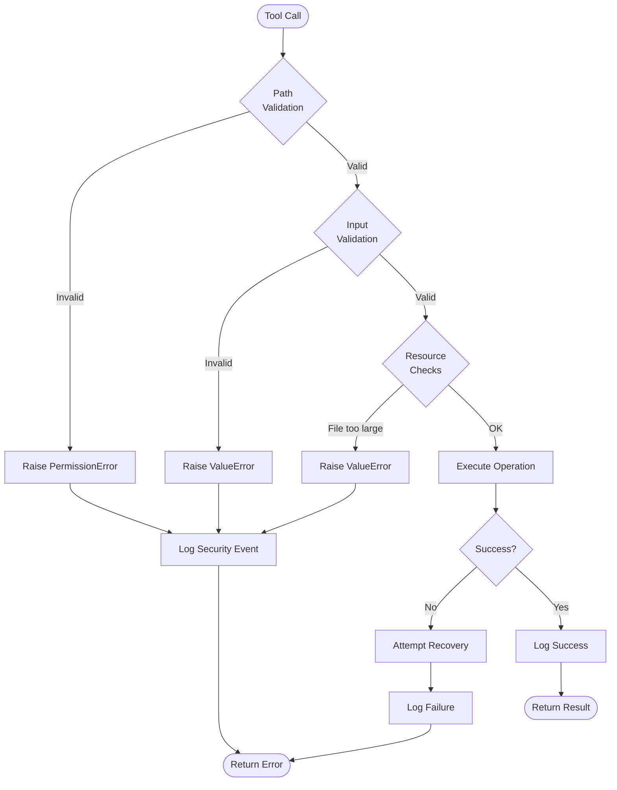
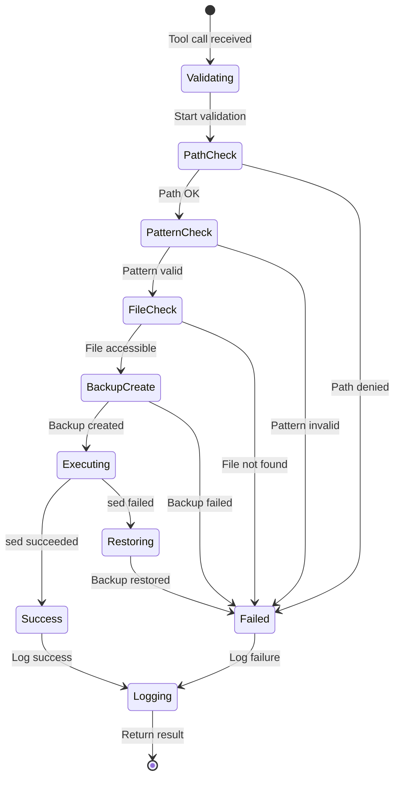
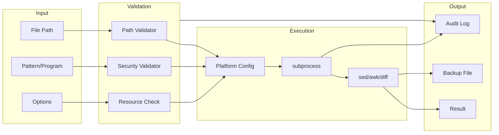
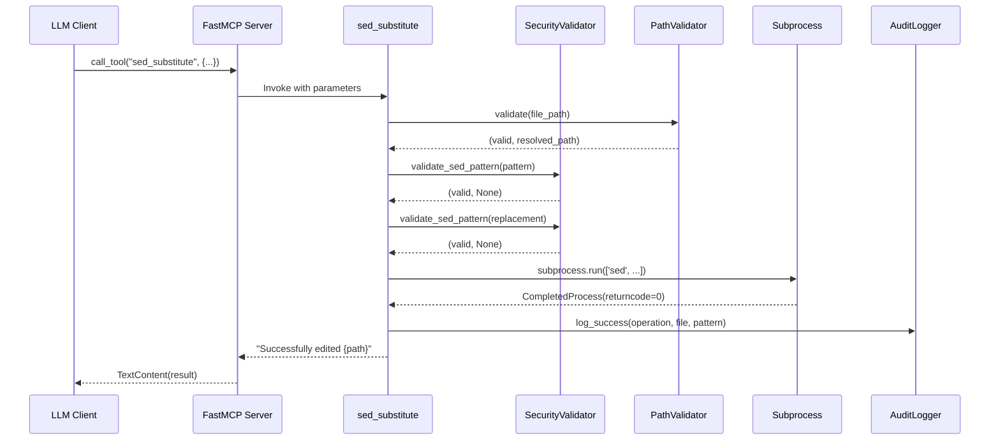

Created: 2025 December 10

# Master Design: sed-awk-diff MCP Server

## Document Information

**Document ID:** design-0000-master_sed-awk-mcp
**Document Type:** Master Design (Tier 1)
**Status:** Approved
**Version:** 1.0
**Author:** William Watson
**Date:** 2025-12-10

## Table of Contents

1. [Project Information](<#1.0 project information>)
2. [Scope](<#2.0 scope>)
3. [System Overview](<#3.0 system overview>)
4. [Design Constraints](<#4.0 design constraints>)
5. [Architecture](<#5.0 architecture>)
6. [Components](<#6.0 components>)
7. [Data Design](<#7.0 data design>)
8. [Interfaces](<#8.0 interfaces>)
9. [Error Handling](<#9.0 error handling>)
10. [Non-Functional Requirements](<#10.0 non-functional requirements>)
11. [Visual Documentation](<#11.0 visual documentation>)
12. [Distribution and Tooling](<#12.0 distribution and tooling>)
13. [Integration](<#13.0 integration>)
14. [Security Architecture](<#14.0 security architecture>)
15. [References](<#15.0 references>)

---

## 1.0 Project Information

**Project Name:** sed-awk-diff MCP Server

**Project Version:** 0.1.0

**Project Description:** FastMCP-based Model Context Protocol server providing enhanced file editing capabilities through native sed, awk, and diff binary execution. Designed to complement grep MCP server functionality while maintaining strict security controls.

**Project Purpose:** Enable LLM-assisted text processing and file editing workflows that conserve token usage by leveraging efficient Unix text processing utilities instead of loading entire file contents into context.

**Author:** William Watson

**Date:** 2025-12-10

[Return to Table of Contents](<#table of contents>)

---

## 2.0 Scope

### 2.1 Purpose

Provide LLMs with powerful, token-efficient file editing and analysis capabilities through controlled execution of sed, awk, and diff utilities within security-restricted environments.

### 2.2 In Scope

- sed-based pattern substitution and line editing
- awk-based field extraction and text transformation  
- diff-based file comparison and change visualization
- Preview functionality for change verification before application
- Directory whitelist-based access control
- Comprehensive input validation and sanitization
- Resource limit enforcement
- Platform support: Linux (GNU tools), macOS (BSD tools)
- Integration with filesystem and grep MCP servers
- Audit logging for security-relevant operations

### 2.3 Out of Scope

- Interactive editing (vi/emacs-style)
- Binary file processing
- Network-based file access
- Database operations
- Archive/compression utilities
- Version control operations (git/svn)
- Batch multi-file operations (single file per tool invocation)
- Custom sed/awk interpreter implementation

### 2.4 Future Enhancements

- Smithery registry integration for automated installation
- Natural language prompt parsing for user-friendly tool invocation
- Pip package distribution
- MCP Inspector integration for interactive debugging

### 2.5 Terminology

| Term | Definition |
|------|------------|
| MCP | Model Context Protocol - standardized protocol for LLM tool/resource access |
| FastMCP | Python framework for building production-ready MCP servers |
| sed | Stream editor for filtering and transforming text |
| awk | Pattern scanning and text processing language |
| diff | File comparison utility |
| ReDoS | Regular Expression Denial of Service attack |
| TOCTOU | Time-of-check to time-of-use race condition |
| Whitelist | Explicitly allowed set of directories for file access |
| GNU tools | Linux standard text processing utilities |
| BSD tools | macOS standard text processing utilities |

[Return to Table of Contents](<#table of contents>)

---

## 3.0 System Overview

### 3.1 Description

The sed-awk-diff MCP server exposes Unix text processing utilities as MCP tools, enabling LLMs to perform efficient file editing and analysis operations. The system implements defense-in-depth security through input validation, access control, resource limits, and audit logging.

### 3.2 Context Flow

```
LLM Client → FastMCP Server → Input Validation → Path Validation → 
Resource Checks → Subprocess Execution (sed/awk/diff) → Result Validation → 
Audit Logging → Response to Client
```

### 3.3 Primary Functions

1. **Text Substitution:** Pattern-based find-and-replace in files using sed
2. **Text Transformation:** Field extraction and restructuring using awk
3. **Change Visualization:** File comparison and diff generation
4. **Preview Operations:** Non-destructive change preview before application
5. **Access Control:** Directory whitelist enforcement
6. **Security Validation:** Comprehensive input sanitization
7. **Audit Trail:** Security event logging

[Return to Table of Contents](<#table of contents>)

---

## 4.0 Design Constraints

### 4.1 Technical Constraints

- Native binary dependencies: sed, awk, diff must be present on host system
- Platform-specific behavior differences between GNU (Linux) and BSD (macOS) tools
- Subprocess execution overhead for each operation
- File size limited to 10MB per operation
- Pattern complexity constrained to prevent ReDoS attacks
- Single file per tool invocation (no batch processing)

### 4.2 Implementation

**Language:** Python 3.10+

**Framework:** FastMCP 2.0

**Libraries:**
- fastmcp: MCP server framework
- subprocess: Native binary execution
- pathlib: Path manipulation and validation
- shutil: File operations and binary verification
- resource: Process resource limits (Linux only)
- sys: Command-line argument parsing

**Standards:**
- POSIX command-line utilities
- MCP server configuration conventions
- OWASP command injection prevention guidelines
- CWE-78 OS command injection mitigation
- CWE-22 path traversal prevention

**Configuration:** MCP standard command-line arguments for directory whitelist

### 4.3 Distribution

**Package Manager:** pip (Python Package Index)

**Package Name:** mcp-sed-awk or sed-awk-mcp

**Entry Points:**
- `sed-awk-server` - Main server executable
- `sed-awk-inspector` - MCP Inspector integration (optional)

**Registry Integration:** Smithery (https://smithery.ai) for automated Claude Desktop installation

**Installation Methods:**
1. Via Smithery (recommended): `npx -y @smithery/cli install @username/mcp-sed-awk --client claude`
2. Via pip: `pip install mcp-sed-awk`
3. Development mode: `pip install -e ".[dev]"`

### 4.4 Performance Targets

| Metric | Target Value |
|--------|--------------|
| Operation timeout | 30 seconds max |
| Maximum file size | 10 MB |
| Pattern length | 1000 characters max |
| AWK program length | 2000 characters max |
| Memory per operation | 100 MB max (Linux) |
| CPU time per operation | 30 seconds max (Linux) |

[Return to Table of Contents](<#table of contents>)

---

## 5.0 Architecture

### 5.1 Pattern

**Layered security architecture** with tool-based interface:

```
┌─────────────────────────────────────┐
│   FastMCP Server (MCP Protocol)     │
└─────────────────────────────────────┘
                 ↓
┌─────────────────────────────────────┐
│   Tool Interface Layer              │
│   - sed_substitute                  │
│   - awk_transform                   │
│   - diff_files                      │
│   - preview_sed                     │
│   - list_allowed_directories        │
└─────────────────────────────────────┘
                 ↓
┌─────────────────────────────────────┐
│   Security Validation Layer         │
│   - Input validation                │
│   - Path validation                 │
│   - Resource checking               │
└─────────────────────────────────────┘
                 ↓
┌─────────────────────────────────────┐
│   Execution Layer                   │
│   - Subprocess management           │
│   - Timeout enforcement             │
│   - Error recovery                  │
└─────────────────────────────────────┘
                 ↓
┌─────────────────────────────────────┐
│   Audit Layer                       │
│   - Security logging                │
│   - Operation tracking              │
└─────────────────────────────────────┘
```

### 5.2 Component Relationships

```
SecurityValidator ← Tool Implementations → PathValidator
       ↓                     ↓                    ↓
PlatformConfig ← SubprocessManager → AuditLogger
```

### 5.3 Technology Stack

**Language:** Python 3.10+
**Framework:** FastMCP 2.0
**Dependencies:** fastmcp
**External Binaries:** sed, awk, diff (system-provided)
**Data Store:** None (stateless operation)

### 5.4 Directory Structure

```
mcp-sed-awk/
├── src/
│   └── sed_awk_mcp/
│       ├── __init__.py
│       ├── server.py              # FastMCP server initialization
│       ├── tools/
│       │   ├── __init__.py
│       │   ├── sed_tool.py        # sed operations
│       │   ├── awk_tool.py        # awk operations
│       │   ├── diff_tool.py       # diff operations
│       │   └── preview_tool.py    # preview operations
│       ├── security/
│       │   ├── __init__.py
│       │   ├── validator.py       # Input validation
│       │   └── path_validator.py  # Path access control
│       ├── platform/
│       │   ├── __init__.py
│       │   └── config.py          # Platform-specific handling
│       └── audit/
│           ├── __init__.py
│           └── logger.py          # Audit logging
├── tests/
│   └── sed_awk_mcp/
│       ├── test_sed_tool.py
│       ├── test_awk_tool.py
│       ├── test_diff_tool.py
│       ├── test_validator.py
│       └── test_path_validator.py
└── docs/
    ├── security.md                # Security architecture
    └── README.md                  # User documentation
```

[Return to Table of Contents](<#table of contents>)

---

## 6.0 Components

### 6.1 FastMCP Server

**Purpose:** Initialize and configure MCP server with security settings

**Responsibilities:**
- FastMCP instance creation
- Tool registration
- Configuration management
- Server lifecycle management

**Inputs:**
- Command-line arguments (sys.argv[1:]) - Primary configuration method
- Environment variable (ALLOWED_DIRECTORIES) - Fallback
- Default: Current working directory

**Outputs:**
- Running MCP server instance

**Key Elements:**
- `mcp: FastMCP` - Server instance
- `path_validator: PathValidator` - Access control
- `security_validator: SecurityValidator` - Input validation
- `platform_config: PlatformConfig` - Platform handling

**Dependencies:**
- External: fastmcp
- Internal: security.validator, security.path_validator, platform.config

**Processing Logic:**
1. Parse command-line arguments for allowed directories
2. Fallback to ALLOWED_DIRECTORIES environment variable if no arguments
3. Default to current working directory if no configuration
4. Initialize validators with allowed directories
5. Verify required binaries present
6. Register tool functions
7. Start server on specified transport

**Error Conditions:**
- Missing required binaries → RuntimeError
- Invalid configuration → ValueError
- Configuration file permission errors → PermissionError

### 6.2 SecurityValidator

**Purpose:** Validate sed patterns, awk programs, and other inputs for security threats

**Responsibilities:**
- Pattern complexity analysis
- Command/function blacklist enforcement
- Metacharacter filtering
- ReDoS detection

**Inputs:**
- `pattern: str` - Sed regex pattern
- `program: str` - AWK program
- `address: str` - Sed address range
- `separator: str` - AWK field separator

**Outputs:**
- `Tuple[bool, Optional[str]]` - (is_valid, error_message)

**Key Elements:**
- `validate_sed_pattern()` - Pattern validation
- `validate_awk_program()` - Program validation
- `validate_sed_address()` - Address validation
- `validate_field_separator()` - Separator validation
- `_check_regex_complexity()` - ReDoS prevention
- `_validate_escape_sequences()` - Escape validation

**Dependencies:**
- External: re
- Internal: None

**Processing Logic:**
1. Length validation
2. Forbidden character check
3. Command/function blacklist check
4. Complexity analysis
5. Escape sequence validation

**Error Conditions:**
- Pattern too long → Validation failure
- Forbidden characters → Validation failure
- Blacklisted commands → Validation failure
- Excessive complexity → Validation failure

### 6.3 PathValidator

**Purpose:** Enforce directory whitelist for file access

**Responsibilities:**
- Path canonicalization
- Whitelist verification
- TOCTOU prevention

**Inputs:**
- `file_path: str` - Requested file path
- `allowed_directories: List[str]` - Whitelist

**Outputs:**
- `Tuple[bool, Optional[str], Optional[Path]]` - (is_valid, error_message, resolved_path)

**Key Elements:**
- `validate()` - Path validation
- `list_allowed()` - Return whitelist

**Dependencies:**
- External: pathlib
- Internal: None

**Processing Logic:**
1. Resolve path to absolute canonical form (eliminate .., symlinks)
2. Check if resolved path is subpath of any allowed directory
3. Return resolved path for use in operations

**Error Conditions:**
- Path outside whitelist → Access denied
- Invalid path syntax → ValueError
- Path resolution failure → OSError

### 6.4 PlatformConfig

**Purpose:** Handle platform-specific tool differences

**Responsibilities:**
- Binary verification
- Version detection (GNU vs BSD)
- Argument normalization

**Inputs:**
- System platform information

**Outputs:**
- Platform-specific command arguments

**Key Elements:**
- `_validate_binaries()` - Verify sed/awk/diff present
- `get_sed_version()` - Detect GNU vs BSD
- `normalize_sed_args()` - Platform-appropriate args

**Dependencies:**
- External: platform, shutil, subprocess
- Internal: None

**Processing Logic:**
1. Detect operating system
2. Verify required binaries exist
3. Detect sed variant (GNU/BSD)
4. Provide normalized command arguments

**Error Conditions:**
- Missing binaries → RuntimeError
- Unsupported platform → RuntimeError

### 6.5 Tool: sed_substitute

**Purpose:** Execute sed pattern substitution on file

**Responsibilities:**
- Input validation
- Path validation
- File backup creation
- Sed execution
- Error recovery

**Inputs:**
- `file_path: str` - Target file
- `pattern: str` - Search pattern
- `replacement: str` - Replacement text
- `line_range: str` - Optional line address
- `backup: bool` - Create backup (default: True)
- `ctx: Context` - FastMCP context

**Outputs:**
- `str` - Success message or error

**Key Elements:**
- Function: `sed_substitute()` - Async tool function

**Dependencies:**
- Internal: SecurityValidator, PathValidator, PlatformConfig
- External: subprocess, pathlib

**Processing Logic:**
1. Validate file path (whitelist check)
2. Validate pattern and replacement
3. Validate line range (if provided)
4. Check file exists and size
5. Build platform-specific sed command
6. Execute with timeout
7. On failure: restore backup
8. Return success status

**Error Conditions:**
- Path validation failure → PermissionError
- Pattern validation failure → ValueError
- File not found → FileNotFoundError
- File too large → ValueError
- sed execution failure → RuntimeError
- Timeout → TimeoutError

### 6.6 Tool: awk_transform

**Purpose:** Execute awk text transformation on file

**Responsibilities:**
- Program validation
- Path validation
- AWK execution
- Output handling

**Inputs:**
- `file_path: str` - Input file
- `program: str` - AWK program
- `output_file: str` - Optional output file
- `field_separator: str` - Optional field separator
- `ctx: Context` - FastMCP context

**Outputs:**
- `str` - Transformed text or success message

**Key Elements:**
- Function: `awk_transform()` - Async tool function

**Dependencies:**
- Internal: SecurityValidator, PathValidator
- External: subprocess, pathlib

**Processing Logic:**
1. Validate input file path
2. Validate output file path (if provided)
3. Validate AWK program
4. Validate field separator
5. Build awk command
6. Execute with timeout
7. Return output or write to file

**Error Conditions:**
- Path validation failure → PermissionError
- Program validation failure → ValueError
- AWK execution failure → RuntimeError
- Timeout → TimeoutError

### 6.7 Tool: diff_files

**Purpose:** Compare two files and generate unified diff

**Responsibilities:**
- Path validation (both files)
- Diff execution
- Output formatting

**Inputs:**
- `file1: str` - First file
- `file2: str` - Second file
- `unified: int` - Context lines (default: 3)
- `ctx: Context` - FastMCP context

**Outputs:**
- `str` - Unified diff output

**Key Elements:**
- Function: `diff_files()` - Async tool function

**Dependencies:**
- Internal: PathValidator
- External: subprocess, pathlib

**Processing Logic:**
1. Validate both file paths
2. Verify files exist
3. Execute diff command
4. Return diff output (empty if identical)

**Error Conditions:**
- Path validation failure → PermissionError
- File not found → FileNotFoundError
- Diff execution failure (exit code > 1) → RuntimeError

### 6.8 Tool: preview_sed

**Purpose:** Preview sed changes without modifying file

**Responsibilities:**
- Create temporary working copy
- Apply sed to temp file
- Generate diff of changes
- Cleanup temp file

**Inputs:**
- `file_path: str` - Target file
- `pattern: str` - Search pattern
- `replacement: str` - Replacement text
- `line_range: str` - Optional line address
- `ctx: Context` - FastMCP context

**Outputs:**
- `str` - Unified diff showing proposed changes

**Key Elements:**
- Function: `preview_sed()` - Async tool function

**Dependencies:**
- Internal: SecurityValidator, PathValidator
- External: subprocess, tempfile, pathlib

**Processing Logic:**
1. Validate inputs (same as sed_substitute)
2. Create temporary copy of file
3. Apply sed to temporary file
4. Generate diff between original and modified
5. Cleanup temporary file
6. Return diff output

**Error Conditions:**
- Same as sed_substitute
- Temp file creation failure → OSError

### 6.9 Tool: list_allowed_directories

**Purpose:** Display accessible directories

**Responsibilities:**
- Query PathValidator for whitelist
- Format output

**Inputs:**
- `ctx: Context` - FastMCP context

**Outputs:**
- `str` - Formatted list of allowed directories

**Key Elements:**
- Function: `list_allowed_directories()` - Async tool function

**Dependencies:**
- Internal: PathValidator
- External: None

**Processing Logic:**
1. Query PathValidator.list_allowed()
2. Format as bulleted list
3. Return formatted output

**Error Conditions:**
- None

[Return to Table of Contents](<#table of contents>)

---

## 7.0 Data Design

### 7.1 Entities

No persistent data storage required. All operations are stateless transformations.

### 7.2 Configuration Data

#### 7.2.1 Allowed Directories

**Purpose:** Whitelist of accessible directories

**Attributes:**
- `directory_path: str` - Absolute path to allowed directory
- Constraints: Must be valid absolute path

**Storage (Priority Order):**
1. **Command-line arguments** (MCP standard): `sys.argv[1:]`
   - Specified in `claude_desktop_config.json` args array
   - Example: `["python", "-m", "sed_awk_mcp.server", "/path1", "/path2"]`
2. **Environment variable:** `ALLOWED_DIRECTORIES` (colon-separated)
   - Fallback when no command-line arguments provided
   - Example: `ALLOWED_DIRECTORIES="/path1:/path2"`
3. **Default:** Current working directory only
   - Used when no configuration provided

**MCP Configuration Example:**
```json
{
  "mcpServers": {
    "sed-awk-diff": {
      "command": "python",
      "args": [
        "-m",
        "sed_awk_mcp.server",
        "/Users/username/projects",
        "/Users/username/documents"
      ]
    }
  }
}
```

**Validation Rules:**
- Must be absolute paths
- Must exist at server startup
- Must be directories (not files)
- Relative paths will be resolved to absolute

### 7.3 Runtime Data

#### 7.3.1 Operation Parameters

Transient data passed to tool functions:
- File paths (validated and resolved)
- Patterns/programs (validated)
- Configuration options (backup, output path, etc.)

#### 7.3.2 Audit Log Entries

**Structure:**
```json
{
  "timestamp": "ISO-8601 datetime",
  "operation": "tool_name",
  "file": "path",
  "pattern": "truncated_pattern",
  "user": "mcp_client_id",
  "success": boolean,
  "error": "error_message"
}
```

**Storage:** System logging infrastructure

[Return to Table of Contents](<#table of contents>)

---

## 8.0 Interfaces

### 8.1 Internal Interfaces

#### 8.1.1 SecurityValidator.validate_sed_pattern()

**Purpose:** Validate sed pattern for security

**Signature:**
```python
def validate_sed_pattern(self, pattern: str) -> Tuple[bool, Optional[str]]
```

**Parameters:**
- `pattern: str` - Sed regex pattern to validate

**Returns:**
- `Tuple[bool, Optional[str]]` - (is_valid, error_message)

**Raises:**
- None (returns validation status)

#### 8.1.2 PathValidator.validate()

**Purpose:** Validate file path against whitelist

**Signature:**
```python
def validate(self, file_path: str) -> Tuple[bool, Optional[str], Optional[Path]]
```

**Parameters:**
- `file_path: str` - Path to validate

**Returns:**
- `Tuple[bool, Optional[str], Optional[Path]]` - (is_valid, error_message, resolved_path)

**Raises:**
- None (returns validation status)

#### 8.1.3 PlatformConfig.normalize_sed_args()

**Purpose:** Generate platform-appropriate sed arguments

**Signature:**
```python
def normalize_sed_args(self, in_place: bool, backup_ext: str) -> List[str]
```

**Parameters:**
- `in_place: bool` - Enable in-place editing
- `backup_ext: str` - Backup file extension

**Returns:**
- `List[str]` - Platform-specific sed arguments

**Raises:**
- None

### 8.2 External Interfaces (MCP Tools)

All tools are exposed as FastMCP tool functions using `@mcp.tool` decorator.

**Natural Language Support:** Tool descriptions designed for LLM interpretation, enabling natural language invocations like:
- "Replace all TODO with FIXME in src/main.py"
- "Show me what would change if I substitute 'old' with 'new' in config.txt"
- "Compare the development and production versions of settings.json"

#### 8.2.1 sed_substitute

**Protocol:** MCP tool invocation
**Data Format:** JSON arguments
**Specification:**
```json
{
  "name": "sed_substitute",
  "description": "Substitute pattern in file using sed",
  "inputSchema": {
    "type": "object",
    "properties": {
      "file_path": {"type": "string"},
      "pattern": {"type": "string"},
      "replacement": {"type": "string"},
      "line_range": {"type": "string"},
      "backup": {"type": "boolean"}
    },
    "required": ["file_path", "pattern", "replacement"]
  }
}
```

#### 8.2.2 awk_transform

**Protocol:** MCP tool invocation
**Data Format:** JSON arguments
**Specification:**
```json
{
  "name": "awk_transform",
  "description": "Transform file using awk",
  "inputSchema": {
    "type": "object",
    "properties": {
      "file_path": {"type": "string"},
      "program": {"type": "string"},
      "output_file": {"type": "string"},
      "field_separator": {"type": "string"}
    },
    "required": ["file_path", "program"]
  }
}
```

#### 8.2.3 diff_files

**Protocol:** MCP tool invocation
**Data Format:** JSON arguments
**Specification:**
```json
{
  "name": "diff_files",
  "description": "Compare two files using diff",
  "inputSchema": {
    "type": "object",
    "properties": {
      "file1": {"type": "string"},
      "file2": {"type": "string"},
      "unified": {"type": "integer"}
    },
    "required": ["file1", "file2"]
  }
}
```

#### 8.2.4 preview_sed

**Protocol:** MCP tool invocation
**Data Format:** JSON arguments
**Specification:**
```json
{
  "name": "preview_sed",
  "description": "Preview sed changes without modifying file",
  "inputSchema": {
    "type": "object",
    "properties": {
      "file_path": {"type": "string"},
      "pattern": {"type": "string"},
      "replacement": {"type": "string"},
      "line_range": {"type": "string"}
    },
    "required": ["file_path", "pattern", "replacement"]
  }
}
```

#### 8.2.5 list_allowed_directories

**Protocol:** MCP tool invocation
**Data Format:** No arguments
**Specification:**
```json
{
  "name": "list_allowed_directories",
  "description": "Display directories accessible to this MCP server",
  "inputSchema": {
    "type": "object",
    "properties": {}
  }
}
```

[Return to Table of Contents](<#table of contents>)

---

## 9.0 Error Handling

### 9.1 Exception Hierarchy

**Base:** Standard Python exceptions

**Specific:**
- `PermissionError` - Path validation failure
- `ValueError` - Input validation failure
- `FileNotFoundError` - File does not exist
- `RuntimeError` - Binary execution failure
- `TimeoutError` (subprocess.TimeoutExpired) - Operation timeout
- `OSError` - File system operation failure

### 9.2 Strategy

#### 9.2.1 Validation Errors
- Catch at validation layer
- Return descriptive error via FastMCP context
- Log security-relevant validations
- Do not execute operation

#### 9.2.2 Runtime Errors
- Catch at execution layer
- Attempt automatic recovery (restore backup)
- Return error details via FastMCP context
- Log failure for audit

#### 9.2.3 External Failures
- Catch subprocess errors
- Parse stderr for details
- Return formatted error message
- Log failure with command details

### 9.3 Logging

**Levels:**
- `INFO` - Normal operations, successful completions
- `WARNING` - Validation failures, recoverable errors
- `ERROR` - Operation failures, binary errors
- `CRITICAL` - System-level failures (missing binaries)

**Required Information:**
- Timestamp
- Operation name
- File path (truncated if long)
- Pattern/program (truncated to 100 chars)
- Success/failure status
- Error message (if applicable)

**Format:**
```
{timestamp} {level} {operation} file={path} pattern={pattern[:100]} success={bool} error={msg}
```

[Return to Table of Contents](<#table of contents>)

---

## 10.0 Non-Functional Requirements

### 10.1 Performance

| Requirement | Target | Measurement |
|-------------|--------|-------------|
| Operation latency | < 5s (typical) | Time from tool call to response |
| Maximum operation time | 30s | Enforced via timeout |
| File size limit | 10 MB | Enforced before processing |
| Memory per operation | 100 MB | Enforced via resource limits (Linux) |
| CPU time | 30s | Enforced via resource limits (Linux) |
| Concurrent operations | No limit | Stateless design |

### 10.2 Security

**Authentication:** Inherited from FastMCP server configuration

**Authorization:** Directory whitelist enforced for all file operations

**Configuration Security:**
- Whitelist configured via `claude_desktop_config.json` (MCP standard)
- No sensitive data in configuration (only directory paths)
- Environment variable fallback for scripted deployments

**Data Protection:**
- Automatic backup creation (sed operations)
- Rollback on failure
- Pattern truncation in logs (protect sensitive data)

### 10.3 Reliability

**Error Recovery:**
- Automatic backup restoration on sed failure
- Temporary file cleanup in preview operations
- Graceful handling of missing binaries at startup

**Fault Tolerance:**
- Input validation prevents malformed operations
- Timeout enforcement prevents hanging
- Resource limits prevent exhaustion (Linux)

### 10.4 Maintainability

**Code Organization:**
- Modular component design
- Separation of concerns (validation, execution, audit)
- Platform-specific logic isolated

**Documentation:**
- Comprehensive security.md documentation
- Inline docstrings for all functions
- Type hints for all function signatures
- README with usage examples
- CHANGELOG.md for version tracking

**Testing:**
- Unit tests for all validators
- Integration tests for tool functions
- Platform-specific test cases
- Security-focused test scenarios
- MCP Inspector integration for interactive testing and debugging

**Coverage Target:** 80% code coverage

**Test Approaches:**
- pytest framework
- unittest.mock for subprocess isolation
- tempfile for test environment isolation
- Parametrized tests for platform differences

**Development Tools:**
- MCP Inspector web UI for interactive tool testing
- Automated testing via GitHub Actions
- Pre-commit hooks for code quality

[Return to Table of Contents](<#table of contents>)

---

## 11.0 Visual Documentation

### 11.1 System Architecture Diagram

```mermaid
flowchart TD
    Client[LLM Client] -->|MCP Protocol| Server[FastMCP Server]
    Server --> Tools[Tool Interface Layer]
    
    Tools --> SedTool[sed_substitute]
    Tools --> AwkTool[awk_transform]
    Tools --> DiffTool[diff_files]
    Tools --> PreviewTool[preview_sed]
    Tools --> ListTool[list_allowed_directories]
    
    SedTool --> Security[Security Validation]
    AwkTool --> Security
    DiffTool --> Security
    PreviewTool --> Security
    
    Security --> SecVal[SecurityValidator]
    Security --> PathVal[PathValidator]
    
    SedTool --> Exec[Execution Layer]
    AwkTool --> Exec
    DiffTool --> Exec
    PreviewTool --> Exec
    
    Exec --> Platform[PlatformConfig]
    Exec --> Subprocess[subprocess.run]
    
    Subprocess --> Sed[/usr/bin/sed]
    Subprocess --> Awk[/usr/bin/awk]
    Subprocess --> Diff[/usr/bin/diff]
    
    Exec --> Audit[Audit Layer]
    Security --> Audit
    
    Audit --> Logger[AuditLogger]
```

**Purpose:** Shows overall system architecture with component relationships and data flow.

**Legend:**
- Rectangles: Components/modules
- Parallelograms: External binaries
- Arrows: Data/control flow

### 11.2 Security Validation Flow



**Purpose:** Illustrates defense-in-depth security validation flow.

**Legend:**
- Ovals: Start/end points
- Diamonds: Decision points
- Rectangles: Processing steps

### 11.3 sed_substitute State Machine



**Purpose:** Shows state transitions during sed substitution operation with error recovery.

**Legend:**
- States: Oval shapes
- Transitions: Arrows with conditions
- Final state: [*]

### 11.4 Data Flow Diagram



**Purpose:** Illustrates data flow from inputs through validation, execution, and outputs.

**Legend:**
- Subgraphs: Logical component groupings
- Boxes: Data elements
- Arrows: Data flow direction

### 11.5 Component Interaction Diagram



**Purpose:** Shows interaction sequence between components during successful operation.

**Legend:**
- Participants: System components
- Solid arrows: Synchronous calls
- Dashed arrows: Returns

[Return to Table of Contents](<#table of contents>)

---

## 12.0 Distribution and Tooling

### 12.1 Package Distribution

**PyPI Package:**
```bash
# Install from PyPI
pip install mcp-sed-awk

# Development installation
git clone https://github.com/username/mcp-sed-awk.git
cd mcp-sed-awk
pip install -e ".[dev]"
```

**pyproject.toml configuration:**
```toml
[project]
name = "mcp-sed-awk"
version = "0.1.0"
description = "MCP server for sed, awk, and diff operations"

[project.scripts]
sed-awk-server = "sed_awk_mcp.server:main"
sed-awk-inspector = "sed_awk_mcp.inspector:main"

[project.optional-dependencies]
dev = [
    "pytest>=7.0.0",
    "pytest-asyncio>=0.21.0",
    "pytest-cov>=4.0.0",
]
```

### 12.2 Smithery Integration

**Purpose:** Automated installation for Claude Desktop users

**smithery.yaml configuration:**
```yaml
name: mcp-sed-awk
version: 0.1.0
description: Enhanced file editing via sed, awk, and diff
author: William Watson
license: MIT

install:
  type: pip
  package: mcp-sed-awk

config:
  command: python
  args:
    - "-m"
    - "sed_awk_mcp.server"
  
schema:
  properties:
    allowed_directories:
      type: array
      items:
        type: string
      description: Directories accessible to the server
      required: true
```

**Installation via Smithery:**
```bash
npx -y @smithery/cli install @username/mcp-sed-awk --client claude
```

### 12.3 MCP Inspector Integration

**Purpose:** Interactive testing and debugging web UI

**Implementation:**
```python
# src/sed_awk_mcp/inspector.py
from mcp.server.stdio import stdio_server
from .server import create_server

def main():
    """Launch MCP Inspector with sed-awk-mcp server"""
    mcp = create_server()
    
    # Inspector provides web UI at http://localhost:5173
    stdio_server(mcp)

if __name__ == "__main__":
    main()
```

**Usage:**
```bash
sed-awk-inspector
# Opens browser to http://localhost:5173
# - Explore available tools
# - Test operations interactively
# - View formatted results
# - Debug parameter issues
```

### 12.4 Natural Language Prompt Support

**Implementation Strategy:**

Tool descriptions crafted for LLM interpretation:

```python
@mcp.tool
async def sed_substitute(
    file_path: str,
    pattern: str,
    replacement: str,
    line_range: str = "",
    backup: bool = True,
    ctx: Context
) -> str:
    """
    Replace text patterns in a file using sed regular expressions.
    
    Natural language examples:
    - "Replace all TODO with FIXME in src/main.py"
    - "Change 'debug=True' to 'debug=False' in config.py"
    - "Substitute 'old_function' with 'new_function' on lines 10-20"
    
    Supports regex patterns and line range restrictions.
    Automatically creates .bak backup before editing.
    """
    # Implementation...
```

**Benefits:**
- LLMs can map natural language to tool parameters
- Users don't need to know sed syntax
- Examples in docstrings guide LLM tool selection

[Return to Table of Contents](<#table of contents>)

---

## 13.0 Integration

### 13.1 grep MCP Integration

**Workflow:** grep → sed/awk pipeline

**Example:**
1. grep MCP: Find all files containing "TODO"
2. sed-awk MCP: Replace "TODO" with "FIXME" in each file
3. diff tool: Verify changes

**Benefits:**
- Token-efficient file discovery
- Bulk editing without loading full files
- Change verification before commit

### 13.2 Filesystem MCP Integration

**Relationship:** Complementary functionality

**Filesystem MCP provides:**
- File reading/writing
- Directory listing
- File metadata

**sed-awk-diff MCP provides:**
- Pattern-based editing
- Field extraction
- Change visualization

**Use case:** Filesystem MCP for simple edits, sed-awk MCP for complex transformations

### 13.3 Security Boundary

Both servers share directory whitelist concept:
- Consistent security model
- No privilege escalation via tool switching
- Same access control principles

[Return to Table of Contents](<#table of contents>)

---

## 14.0 Security Architecture

See comprehensive documentation: [docs/security.md](<../../docs/security.md>)

**Summary:**

### 14.1 Defense-in-Depth Layers

1. **Input Validation** - Pattern/program sanitization
2. **Access Control** - Directory whitelisting
3. **Resource Protection** - Timeouts and limits
4. **Safe Execution** - No shell invocation
5. **Error Recovery** - Automatic backup/rollback
6. **Audit Trail** - Security event logging

### 14.2 Threat Mitigation

| Threat | Mitigation |
|--------|------------|
| Command injection | Input validation, no shell=True |
| Path traversal | Path canonicalization, whitelist |
| ReDoS | Complexity limits, timeout |
| Resource exhaustion | File size limits, subprocess timeout, resource limits |
| Data corruption | Automatic backup, rollback |

### 14.3 Security Assumptions

- Trusted LLM (not actively adversarial)
- Secured host OS
- Authentic sed/awk/diff binaries
- POSIX-compliant filesystem
- Single-tenant deployment

[Return to Table of Contents](<#table of contents>)

---

## 15.0 References

### 15.1 External Documentation

- FastMCP Documentation: https://gofastmcp.com
- Model Context Protocol: https://modelcontextprotocol.io
- GNU sed Manual: https://www.gnu.org/software/sed/manual/sed.html
- GNU awk Manual: https://www.gnu.org/software/gawk/manual/gawk.html
- OWASP Command Injection: https://cheatsheetseries.owasp.org/cheatsheets/OS_Command_Injection_Defense_Cheat_Sheet.html

### 15.2 Internal Documentation

- Security Architecture: [docs/security.md](<../../docs/security.md>)
- Project README: [README.md](<../../README.md>)
- Governance Framework: [ai/governance.md](<../../ai/governance.md>)

### 15.3 Standards

- CWE-78: OS Command Injection
- CWE-22: Path Traversal
- POSIX.1-2017: Utilities specification

### 15.4 Related Projects

- mcp-grep: https://github.com/erniebrodeur/mcp-grep
- MCP Filesystem Server: https://github.com/modelcontextprotocol/servers/tree/main/src/filesystem
- Smithery Registry: https://smithery.ai

[Return to Table of Contents](<#table of contents>)

---

## Version History

| Version | Date | Author | Changes |
|---------|------|--------|---------|
| 1.0 | 2025-12-10 | William Watson | Initial master design approved from proposal-0001 |

---

Copyright (c) 2025 William Watson. This work is licensed under the MIT License.
