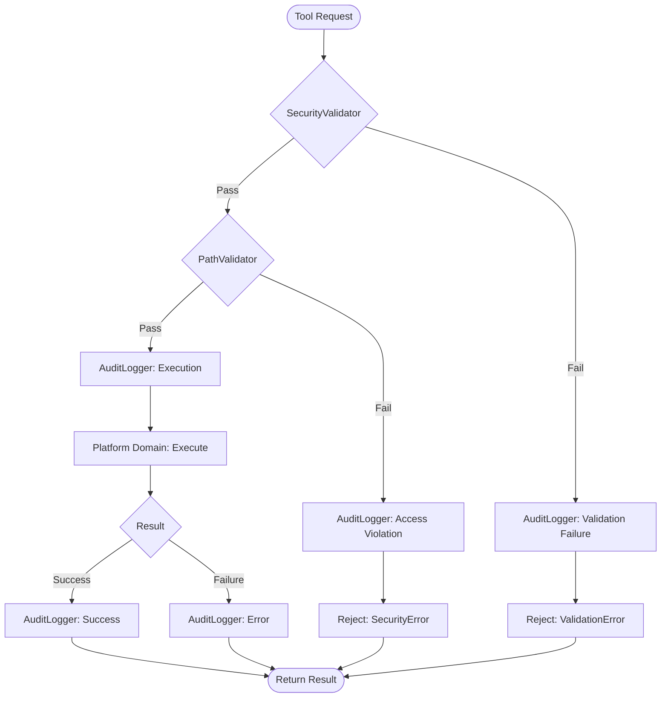
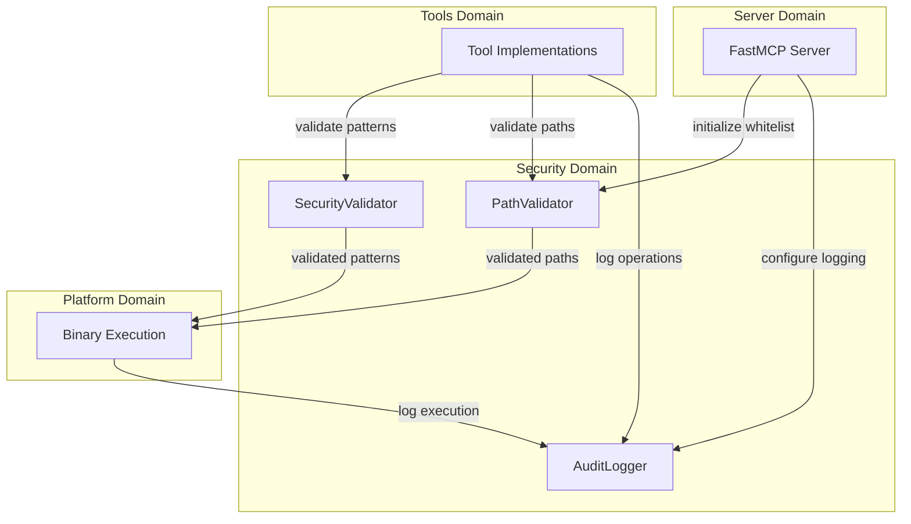

Created: 2025 December 10

# Domain Design: Security

## Document Information

**Document ID:** design-0001-domain_security
**Document Type:** Domain Design (Tier 2)
**Parent Design:** [design-0000-master_sed-awk-mcp](<design-0000-master_sed-awk-mcp.md>)
**Status:** Draft
**Version:** 1.0
**Author:** William Watson
**Date:** 2025-12-10

## Table of Contents

1. [Domain Information](<#1.0 domain information>)
2. [Domain Boundaries](<#2.0 domain boundaries>)
3. [Domain Responsibilities](<#3.0 domain responsibilities>)
4. [Domain Components](<#4.0 domain components>)
5. [Domain Interfaces](<#5.0 domain interfaces>)
6. [Domain Patterns](<#6.0 domain patterns>)
7. [Visual Documentation](<#7.0 visual documentation>)
8. [Tier 3 Components](<#8.0 tier 3 components>)

---

## 1.0 Domain Information

**Domain Name:** Security Domain

**Domain Purpose:** Enforce defense-in-depth security through input validation, access control, resource protection, and audit logging for all sed/awk/diff operations.

**Domain Scope:** All security enforcement mechanisms protecting against command injection, path traversal, ReDoS attacks, resource exhaustion, and data corruption.

**Key Principle:** Security boundaries enforced at Python layer; native binaries handle only validated content transformation.

[Return to Table of Contents](<#table of contents>)

---

## 2.0 Domain Boundaries

### 2.1 In Scope

- Pattern and program validation (sed/awk syntax)
- Command blacklist enforcement
- Shell metacharacter filtering
- ReDoS detection (catastrophic backtracking)
- Path access control (whitelist enforcement)
- Path canonicalization (symlink resolution)
- Resource limit validation
- Security event audit logging
- Error message sanitization

### 2.2 Out of Scope

- Binary execution (Platform Domain)
- Tool-specific logic (Tools Domain)
- MCP protocol handling (Server Domain)
- File I/O operations (delegated to Platform Domain)

### 2.3 Domain Dependencies

**Depends on:**
- Python standard library: `re`, `pathlib`, `logging`
- No external dependencies

**Used by:**
- Tools Domain (all tool implementations)
- Platform Domain (path validation before execution)
- Server Domain (initialization, configuration)

[Return to Table of Contents](<#table of contents>)

---

## 3.0 Domain Responsibilities

### 3.1 Input Validation

- Validate sed patterns and programs against blacklist
- Validate AWK programs against forbidden functions
- Enforce pattern complexity limits
- Filter shell metacharacters
- Detect ReDoS patterns

### 3.2 Access Control

- Enforce directory whitelist
- Canonicalize paths (resolve symlinks, `..`)
- Prevent TOCTOU vulnerabilities
- Block access outside allowed directories

### 3.3 Resource Protection

- Validate file size constraints (<10MB)
- Enforce timeout limits (30s)
- Define resource limit parameters

### 3.4 Audit Trail

- Log security-relevant events
- Record validation failures
- Track access violations
- Sanitize sensitive data in logs

[Return to Table of Contents](<#table of contents>)

---

## 4.0 Domain Components

### 4.1 SecurityValidator

**Purpose:** Validate sed/AWK patterns and programs against security threats.

**Key Elements:**
- `validate_sed_pattern()` - Pattern validation
- `validate_sed_program()` - Program validation
- `validate_awk_program()` - AWK program validation
- `check_complexity()` - ReDoS detection
- `_blacklist` - Forbidden command sets

**Validation Rules:**
```python
# Forbidden sed commands (execution/IO/control flow)
SED_BLACKLIST = {'e', 'r', 'w', 'q', 'Q', 'R', 'W', 'T', 't', 'b', ':'}

# Forbidden AWK functions (system access)
AWK_BLACKLIST = {'system', 'popen', 'getline', 'close', 'fflush'}

# Shell metacharacters
SHELL_METACHARACTERS = {';', '|', '&', '$', '`', '\n', '\r', '\x00'}

# Complexity limits
MAX_PATTERN_LENGTH = 1000
MAX_PROGRAM_LENGTH = 2000
MAX_NESTING_DEPTH = 5
```

### 4.2 PathValidator

**Purpose:** Enforce directory whitelist and prevent path traversal.

**Key Elements:**
- `validate_path()` - Check path against whitelist
- `list_allowed()` - Return allowed directories
- `_allowed_dirs` - Whitelist set
- `_resolve_path()` - Canonicalize with symlink resolution

**Access Control Logic:**
1. Resolve absolute path with `Path.resolve()`
2. Check all parent directories against whitelist
3. Prevent TOCTOU: validate immediately before use
4. Block access outside allowed directories

### 4.3 AuditLogger

**Purpose:** Record security events for analysis and compliance.

**Key Elements:**
- `log_validation_failure()` - Record blocked operations
- `log_access_violation()` - Record unauthorized access attempts
- `log_execution()` - Record successful operations
- `_sanitize()` - Remove sensitive data from logs

**Event Types:**
- Validation failures (pattern blacklist, complexity)
- Access violations (path outside whitelist)
- Execution events (tool invocations)
- Error conditions (timeouts, failures)

[Return to Table of Contents](<#table of contents>)

---

## 5.0 Domain Interfaces

### 5.1 Public Interface

**SecurityValidator:**
```python
class SecurityValidator:
    def validate_sed_pattern(self, pattern: str) -> None:
        """Raises ValidationError if pattern contains forbidden commands."""
        
    def validate_sed_program(self, program: str) -> None:
        """Raises ValidationError if program contains forbidden commands."""
        
    def validate_awk_program(self, program: str) -> None:
        """Raises ValidationError if program contains forbidden functions."""
```

**PathValidator:**
```python
class PathValidator:
    def __init__(self, allowed_dirs: List[str]) -> None:
        """Initialize with whitelist of allowed directories."""
        
    def validate_path(self, path: str) -> Path:
        """Returns canonicalized Path if allowed, raises SecurityError otherwise."""
        
    def list_allowed(self) -> List[str]:
        """Returns list of allowed directory paths."""
```

**AuditLogger:**
```python
class AuditLogger:
    def log_validation_failure(self, tool: str, reason: str, details: Dict) -> None:
        """Log validation failure with sanitized details."""
        
    def log_access_violation(self, path: str, reason: str) -> None:
        """Log unauthorized access attempt."""
        
    def log_execution(self, tool: str, operation: str, path: str) -> None:
        """Log successful tool execution."""
```

### 5.2 Error Interface

**Exceptions:**
```python
class ValidationError(Exception):
    """Raised when input validation fails."""
    
class SecurityError(Exception):
    """Raised when access control violation detected."""
    
class ResourceError(Exception):
    """Raised when resource limits exceeded."""
```

### 5.3 Integration Points

**With Tools Domain:**
- Tools call `SecurityValidator` before any operation
- Tools call `PathValidator.validate_path()` for all file arguments
- Tools use `AuditLogger` to record operations

**With Platform Domain:**
- Platform receives only pre-validated inputs
- Platform performs no additional security checks
- Platform reports execution status to AuditLogger

**With Server Domain:**
- Server initializes PathValidator with CLI-provided directories
- Server catches security exceptions and returns to client
- Server configures audit logging level

[Return to Table of Contents](<#table of contents>)

---

## 6.0 Domain Patterns

### 6.1 Defense in Depth

**Pattern:** Multiple independent security layers.

**Implementation:**
1. Input validation (syntax, blacklist, complexity)
2. Access control (whitelist, canonicalization)
3. Resource limits (size, timeout)
4. Safe execution (no shell, argument arrays)
5. Error recovery (backups, rollback)
6. Audit logging (comprehensive tracking)

**Rationale:** Single layer failure doesn't compromise entire system.

### 6.2 Fail-Safe Defaults

**Pattern:** Deny by default, allow explicitly.

**Implementation:**
- Whitelist-based access (no implicit access)
- Blacklist-based validation (block dangerous operations)
- Conservative limits (restrictive defaults)

**Rationale:** Unknown operations blocked unless explicitly allowed.

### 6.3 Complete Mediation

**Pattern:** Every access checked, no exceptions.

**Implementation:**
- All tool calls validate inputs
- All file paths validated against whitelist
- No caching of authorization decisions (TOCTOU prevention)

**Rationale:** Prevents bypass through cached permissions.

### 6.4 Separation of Concerns

**Pattern:** Security logic isolated from business logic.

**Implementation:**
- Security validators separate from tool implementations
- Path validation separate from file operations
- Audit logging separate from execution

**Rationale:** Security logic reusable, testable, auditable.

[Return to Table of Contents](<#table of contents>)

---

## 7.0 Visual Documentation

### 7.1 Security Flow Diagram



**Purpose:** Shows security enforcement flow through domain components.

**Legend:**
- Rectangles: Processing steps
- Diamonds: Decision points
- Rounded rectangles: Entry/exit points
- Solid arrows: Normal flow
- Dashed arrows: Error flow

### 7.2 Domain Boundary Diagram



**Purpose:** Shows domain boundaries and interaction patterns.

**Cross-references:**
- SecurityValidator: [Section 4.1](<#4.1 securityvalidator>)
- PathValidator: [Section 4.2](<#4.2 pathvalidator>)
- AuditLogger: [Section 4.3](<#4.3 auditlogger>)

[Return to Table of Contents](<#table of contents>)

---

## 8.0 Tier 3 Components

This domain will decompose into the following Tier 3 component designs:

1. **[design-0001-component_security_validator](<design-0001-component_security_validator.md>)** - Pattern/program validation
2. **[design-0001-component_security_path](<design-0001-component_security_path.md>)** - Path access control
3. **[design-0001-component_security_audit](<design-0001-component_security_audit.md>)** - Audit logging

Each component will provide detailed implementation specifications including:
- Class definitions with method signatures
- Data structures and validation rules
- Error handling strategies
- Unit test requirements
- Integration with other components

[Return to Table of Contents](<#table of contents>)

---

## Version History

| Version | Date       | Description            |
| ------- | ---------- | ---------------------- |
| 1.0     | 2025-12-10 | Initial domain design  |

---

Copyright: Copyright (c) 2025 William Watson. This work is licensed under the MIT License.
