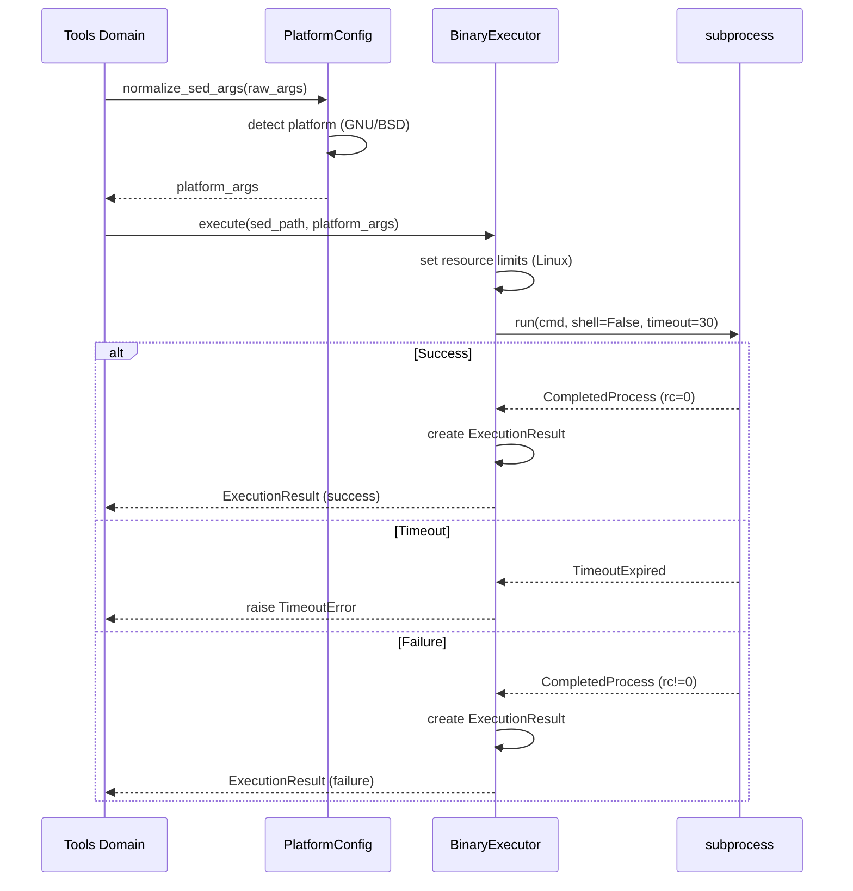
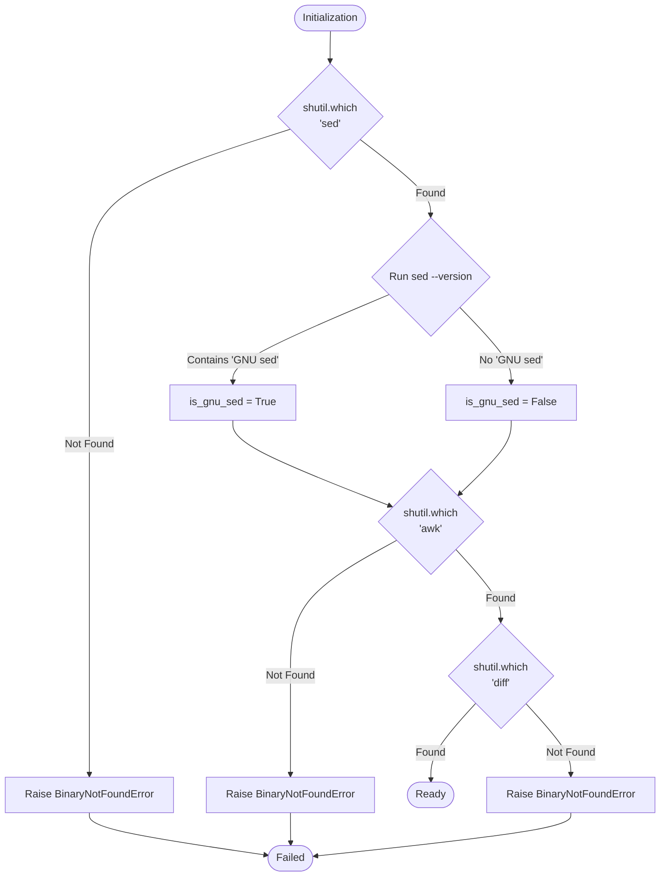

Created: 2025 December 10

# Domain Design: Platform

## Document Information

**Document ID:** design-0002-domain_platform
**Document Type:** Domain Design (Tier 2)
**Parent Design:** [design-0000-master_sed-awk-mcp](<design-0000-master_sed-awk-mcp.md>)
**Status:** Draft
**Version:** 1.0
**Author:** William Watson
**Date:** 2025-12-10

## Table of Contents

1. [Domain Information](<#1.0 domain information>)
2. [Domain Boundaries](<#2.0 domain boundaries>)
3. [Domain Responsibilities](<#3.0 domain responsibilities>)
4. [Domain Components](<#4.0 domain components>)
5. [Domain Interfaces](<#5.0 domain interfaces>)
6. [Domain Patterns](<#6.0 domain patterns>)
7. [Visual Documentation](<#7.0 visual documentation>)
8. [Tier 3 Components](<#8.0 tier 3 components>)

---

## 1.0 Domain Information

**Domain Name:** Platform Domain

**Domain Purpose:** Abstract platform-specific differences (GNU vs BSD) and provide safe subprocess execution of sed, awk, and diff binaries.

**Domain Scope:** Binary detection, argument normalization, subprocess management, resource control, and platform-specific behavior handling.

**Key Principle:** Execute only pre-validated inputs; no security enforcement at this layer.

[Return to Table of Contents](<#table of contents>)

---

## 2.0 Domain Boundaries

### 2.1 In Scope

- Binary location and verification (sed, awk, diff)
- GNU vs BSD detection
- Argument format normalization
- Subprocess execution (shell=False)
- Timeout enforcement
- Resource limits (Linux cgroups)
- Stdout/stderr capture
- Exit code handling

### 2.2 Out of Scope

- Input validation (Security Domain)
- Path access control (Security Domain)
- Tool-specific logic (Tools Domain)
- MCP protocol (Server Domain)
- Backup/rollback logic (Tools Domain)

### 2.3 Domain Dependencies

**Depends on:**
- Python standard library: `subprocess`, `shutil`, `platform`
- Operating system: sed, awk, diff binaries

**Used by:**
- Tools Domain (all tool implementations)

**Uses:**
- Security Domain (receives validated inputs)

[Return to Table of Contents](<#table of contents>)

---

## 3.0 Domain Responsibilities

### 3.1 Binary Management

- Locate sed, awk, diff binaries via `shutil.which()`
- Verify binary executability
- Detect GNU vs BSD variants
- Cache binary paths for performance

### 3.2 Argument Normalization

- Convert arguments to platform-specific format
- Handle in-place editing differences: `-i.bak` (GNU) vs `-i .bak` (BSD)
- Ensure consistent behavior across platforms
- Maintain command array format (no shell)

### 3.3 Subprocess Execution

- Execute binaries with `subprocess.run()`
- Enforce shell=False (security)
- Set timeout limits (30s default)
- Capture stdout/stderr
- Return execution results with exit codes

### 3.4 Resource Control

- Apply resource limits on Linux (setrlimit)
- Memory limit: 100MB
- CPU time limit: 30s
- Graceful degradation on macOS (timeout only)

[Return to Table of Contents](<#table of contents>)

---

## 4.0 Domain Components

### 4.1 PlatformConfig

**Purpose:** Detect platform, locate binaries, normalize arguments.

**Key Elements:**
```python
class PlatformConfig:
    def __init__(self):
        self.sed_path: str
        self.awk_path: str
        self.diff_path: str
        self.is_gnu_sed: bool
        
    def normalize_sed_args(self, args: List[str]) -> List[str]:
        """Convert sed args to platform-specific format."""
        
    def normalize_awk_args(self, args: List[str]) -> List[str]:
        """Convert awk args to platform-specific format."""
        
    def normalize_diff_args(self, args: List[str]) -> List[str]:
        """Convert diff args to platform-specific format."""
```

**Detection Logic:**
```python
# Detect GNU sed
result = subprocess.run(['sed', '--version'], capture_output=True, text=True)
is_gnu = 'GNU sed' in result.stdout

# Normalize in-place editing
if is_gnu:
    args = ['sed', '-i.bak', 's/pattern/replacement/', 'file.txt']
else:  # BSD
    args = ['sed', '-i', '.bak', 's/pattern/replacement/', 'file.txt']
```

### 4.2 BinaryExecutor

**Purpose:** Safe subprocess execution with resource controls.

**Key Elements:**
```python
class BinaryExecutor:
    def execute(
        self,
        binary_path: str,
        args: List[str],
        timeout: int = 30
    ) -> ExecutionResult:
        """Execute binary with timeout and resource limits."""
        
    def _set_limits(self) -> None:
        """Apply resource limits on Linux."""
        
    def _execute_subprocess(
        self,
        cmd: List[str],
        timeout: int
    ) -> subprocess.CompletedProcess:
        """Run subprocess with shell=False."""
```

**Execution Pattern:**
```python
# Always use argument arrays (no shell)
cmd = [binary_path] + normalized_args

# Execute with timeout
result = subprocess.run(
    cmd,
    capture_output=True,
    text=True,
    timeout=timeout,
    shell=False  # Critical security requirement
)
```

### 4.3 ExecutionResult

**Purpose:** Structured result from subprocess execution.

**Data Structure:**
```python
@dataclass
class ExecutionResult:
    stdout: str
    stderr: str
    returncode: int
    duration: float
    
    @property
    def success(self) -> bool:
        return self.returncode == 0
```

[Return to Table of Contents](<#table of contents>)

---

## 5.0 Domain Interfaces

### 5.1 Public Interface

**PlatformConfig:**
```python
class PlatformConfig:
    def __init__(self) -> None:
        """Initialize platform detection and binary location."""
        
    def normalize_sed_args(self, args: List[str]) -> List[str]:
        """Returns platform-specific sed arguments."""
        
    def normalize_awk_args(self, args: List[str]) -> List[str]:
        """Returns platform-specific awk arguments."""
        
    def normalize_diff_args(self, args: List[str]) -> List[str]:
        """Returns platform-specific diff arguments."""
        
    @property
    def binaries(self) -> Dict[str, str]:
        """Returns dict of binary names to paths."""
```

**BinaryExecutor:**
```python
class BinaryExecutor:
    def execute(
        self,
        binary_path: str,
        args: List[str],
        timeout: int = 30,
        apply_limits: bool = True
    ) -> ExecutionResult:
        """Execute binary with resource controls.
        
        Raises:
            TimeoutError: If execution exceeds timeout
            ExecutionError: If binary fails unexpectedly
        """
```

### 5.2 Error Interface

**Exceptions:**
```python
class BinaryNotFoundError(Exception):
    """Raised when required binary not found on system."""
    
class ExecutionError(Exception):
    """Raised when binary execution fails."""
    
class TimeoutError(Exception):
    """Raised when execution exceeds timeout limit."""
```

### 5.3 Integration Points

**With Tools Domain:**
- Tools call `PlatformConfig.normalize_*_args()` before execution
- Tools call `BinaryExecutor.execute()` for subprocess invocation
- Tools handle `ExecutionResult` and extract relevant data

**With Security Domain:**
- Receives only pre-validated inputs (patterns, paths, programs)
- No security enforcement at this layer
- Reports execution status to AuditLogger (via Tools)

[Return to Table of Contents](<#table of contents>)

---

## 6.0 Domain Patterns

### 6.1 Adapter Pattern

**Pattern:** Abstract platform differences behind uniform interface.

**Implementation:**
- `PlatformConfig` detects platform at initialization
- `normalize_*_args()` methods adapt arguments
- Tools use same interface regardless of platform

**Rationale:** Isolates platform complexity from business logic.

### 6.2 Command Pattern

**Pattern:** Encapsulate subprocess invocation as objects.

**Implementation:**
- `ExecutionResult` represents completed operation
- Structured data (stdout, stderr, returncode, duration)
- Enables testing via mocking

**Rationale:** Testable, composable, traceable execution.

### 6.3 Lazy Initialization

**Pattern:** Defer expensive operations until needed.

**Implementation:**
- Binary location cached after first lookup
- Platform detection performed once at startup
- Argument normalization computed per-call (stateless)

**Rationale:** Fast startup, efficient repeated operations.

### 6.4 Fail-Fast

**Pattern:** Detect problems early and loudly.

**Implementation:**
- Binary verification at initialization
- Immediate exception if binary missing
- No silent fallbacks or degraded operation

**Rationale:** Clear error messages, no ambiguous failures.

[Return to Table of Contents](<#table of contents>)

---

## 7.0 Visual Documentation

### 7.1 Platform Execution Flow



**Purpose:** Shows execution flow through platform components.

**Legend:**
- Solid arrows: Synchronous calls
- Dashed arrows: Returns
- alt/else: Conditional paths

### 7.2 Platform Detection Diagram



**Purpose:** Shows binary location and platform detection logic.

**Cross-references:**
- PlatformConfig: [Section 4.1](<#4.1 platformconfig>)
- BinaryExecutor: [Section 4.2](<#4.2 binaryexecutor>)

[Return to Table of Contents](<#table of contents>)

---

## 8.0 Tier 3 Components

This domain will decompose into the following Tier 3 component designs:

1. **[design-0002-component_platform_config](<design-0002-component_platform_config.md>)** - Platform detection and argument normalization
2. **[design-0002-component_platform_executor](<design-0002-component_platform_executor.md>)** - Subprocess execution with resource controls

Each component will provide detailed implementation specifications including:
- Class definitions with complete method signatures
- Platform-specific logic and branching
- Resource limit implementation (Linux vs macOS)
- Error handling and recovery
- Unit test requirements with mocking strategies

[Return to Table of Contents](<#table of contents>)

---

## Version History

| Version | Date       | Description           |
| ------- | ---------- | --------------------- |
| 1.0     | 2025-12-10 | Initial domain design |

---

Copyright: Copyright (c) 2025 William Watson. This work is licensed under the MIT License.
