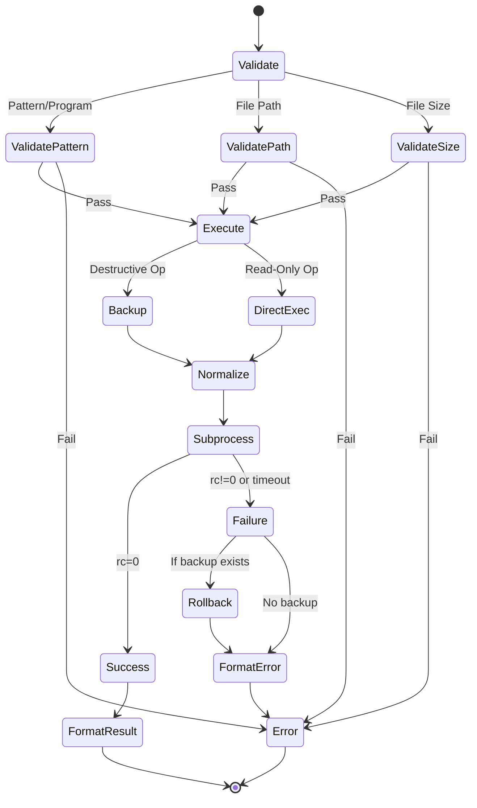
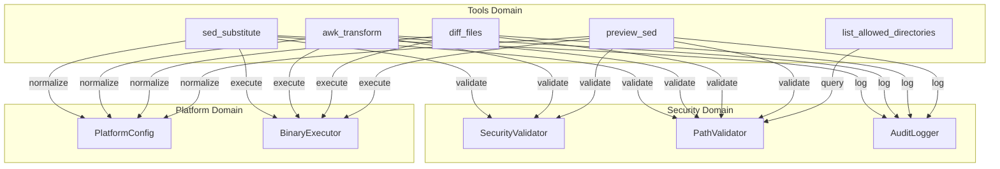

Created: 2025 December 10

# Domain Design: Tools

## Document Information

**Document ID:** design-0003-domain_tools
**Document Type:** Domain Design (Tier 2)
**Parent Design:** [design-0000-master_sed-awk-mcp](<design-0000-master_sed-awk-mcp.md>)
**Status:** Draft
**Version:** 1.0
**Author:** William Watson
**Date:** 2025-12-10

## Table of Contents

1. [Domain Information](<#1.0 domain information>)
2. [Domain Boundaries](<#2.0 domain boundaries>)
3. [Domain Responsibilities](<#3.0 domain responsibilities>)
4. [Domain Components](<#4.0 domain components>)
5. [Domain Interfaces](<#5.0 domain interfaces>)
6. [Domain Patterns](<#6.0 domain patterns>)
7. [Visual Documentation](<#7.0 visual documentation>)
8. [Tier 3 Components](<#8.0 tier 3 components>)

---

## 1.0 Domain Information

**Domain Name:** Tools Domain

**Domain Purpose:** Implement five MCP tool functions providing sed, awk, and diff capabilities through validated, safe subprocess execution.

**Domain Scope:** Tool-specific logic, backup/rollback, parameter handling, result formatting, and integration with Security and Platform domains.

**Key Principle:** Each tool coordinates security validation, platform execution, and error recovery.

[Return to Table of Contents](<#table of contents>)

---

## 2.0 Domain Boundaries

### 2.1 In Scope

- Tool function implementations (async)
- Parameter validation and normalization
- Backup creation before destructive operations
- Rollback on failures
- Result formatting for MCP protocol
- Error message construction
- Integration with Security and Platform domains

### 2.2 Out of Scope

- Security enforcement (Security Domain)
- Subprocess execution (Platform Domain)
- MCP protocol handling (Server Domain)
- Binary location (Platform Domain)

### 2.3 Domain Dependencies

**Depends on:**
- Security Domain: `SecurityValidator`, `PathValidator`, `AuditLogger`
- Platform Domain: `PlatformConfig`, `BinaryExecutor`
- Python standard library: `pathlib`, `shutil`, `tempfile`

**Used by:**
- Server Domain (tool registration)

[Return to Table of Contents](<#table of contents>)

---

## 3.0 Domain Responsibilities

### 3.1 Tool Implementation

- Implement five async tool functions per MCP specification
- Handle tool-specific parameters
- Coordinate validation → execution → result flow
- Format results for MCP protocol

### 3.2 Data Safety

- Create `.bak` backups before in-place edits
- Restore backups on operation failures
- Ensure atomic operations (success or rollback)
- Clean up temporary files

### 3.3 Error Handling

- Catch and translate domain exceptions
- Provide clear, actionable error messages
- Differentiate validation vs execution failures
- Log all operations via AuditLogger

### 3.4 Result Formatting

- Structure output per MCP tool specification
- Include operation metadata (file modified, lines changed)
- Return diff output for preview operations
- Provide empty string for identical files (diff)

[Return to Table of Contents](<#table of contents>)

---

## 4.0 Domain Components

### 4.1 sed_substitute Tool

**Purpose:** Perform in-place pattern substitution with backup and rollback.

**Parameters:**
- `file_path: str` - Target file path
- `pattern: str` - Sed pattern to match
- `replacement: str` - Replacement string
- `line_range: Optional[str]` - Line range (e.g., "1,10")

**Implementation Flow:**
```
1. Validate pattern (SecurityValidator)
2. Validate file_path (PathValidator)
3. Check file size (<10MB)
4. Create backup: file.txt → file.txt.bak
5. Normalize sed args (PlatformConfig)
6. Execute sed (BinaryExecutor)
7. On success: return confirmation
8. On failure: restore backup, raise error
```

### 4.2 awk_transform Tool

**Purpose:** Apply AWK program for field extraction/transformation.

**Parameters:**
- `file_path: str` - Input file path
- `program: str` - AWK program
- `field_separator: Optional[str]` - Field separator (default: whitespace)
- `output_file: Optional[str]` - Output file (optional)

**Implementation Flow:**
```
1. Validate program (SecurityValidator)
2. Validate file_path (PathValidator)
3. Validate output_file if provided (PathValidator)
4. Normalize awk args (PlatformConfig)
5. Execute awk (BinaryExecutor)
6. If output_file: write stdout to file
7. Else: return stdout directly
```

### 4.3 diff_files Tool

**Purpose:** Generate unified diff between two files.

**Parameters:**
- `file1_path: str` - First file path
- `file2_path: str` - Second file path
- `context_lines: int` - Context lines (default: 3)

**Implementation Flow:**
```
1. Validate file1_path (PathValidator)
2. Validate file2_path (PathValidator)
3. Normalize diff args (PlatformConfig)
4. Execute diff (BinaryExecutor)
5. Return unified diff output
6. Return empty string if files identical
```

### 4.4 preview_sed Tool

**Purpose:** Non-destructive preview of sed operation.

**Parameters:**
- Same as sed_substitute

**Implementation Flow:**
```
1. Validate inputs (same as sed_substitute)
2. Create temp copy of file
3. Apply sed to temp copy
4. Generate diff: original vs modified temp
5. Clean up temp file (always)
6. Return diff showing changes
```

### 4.5 list_allowed_directories Tool

**Purpose:** Display directory whitelist.

**Parameters:** None

**Implementation Flow:**
```
1. Query PathValidator.list_allowed()
2. Format as bullet list
3. Return formatted string
```

[Return to Table of Contents](<#table of contents>)

---

## 5.0 Domain Interfaces

### 5.1 Tool Signatures

```python
async def sed_substitute(
    file_path: str,
    pattern: str,
    replacement: str,
    line_range: Optional[str] = None
) -> str:
    """Perform in-place substitution with backup.
    
    Returns: Confirmation message with operation details.
    Raises: ValidationError, SecurityError, ExecutionError
    """

async def awk_transform(
    file_path: str,
    program: str,
    field_separator: Optional[str] = None,
    output_file: Optional[str] = None
) -> str:
    """Apply AWK transformation.
    
    Returns: Transformed output or confirmation if output_file specified.
    Raises: ValidationError, SecurityError, ExecutionError
    """

async def diff_files(
    file1_path: str,
    file2_path: str,
    context_lines: int = 3
) -> str:
    """Generate unified diff.
    
    Returns: Unified diff output or empty string if identical.
    Raises: ValidationError, SecurityError, ExecutionError
    """

async def preview_sed(
    file_path: str,
    pattern: str,
    replacement: str,
    line_range: Optional[str] = None
) -> str:
    """Preview sed operation without modification.
    
    Returns: Diff showing proposed changes.
    Raises: ValidationError, SecurityError, ExecutionError
    """

async def list_allowed_directories() -> str:
    """List allowed directories.
    
    Returns: Formatted list of allowed directory paths.
    """
```

### 5.2 Common Patterns

**Validation Sequence:**
```python
# Pattern/program validation
security_validator.validate_sed_pattern(pattern)

# Path validation
validated_path = path_validator.validate_path(file_path)

# File size check
if validated_path.stat().st_size > MAX_FILE_SIZE:
    raise ResourceError(f"File exceeds {MAX_FILE_SIZE} bytes")
```

**Backup and Rollback:**
```python
backup_path = Path(f"{file_path}.bak")
shutil.copy2(file_path, backup_path)

try:
    # Execute operation
    result = await executor.execute(...)
    if not result.success:
        # Restore backup
        shutil.copy2(backup_path, file_path)
        raise ExecutionError(result.stderr)
finally:
    # Optionally remove backup on success
    pass
```

**Audit Logging:**
```python
try:
    audit_logger.log_execution("sed_substitute", "in-place edit", file_path)
    # ... perform operation
except ValidationError as e:
    audit_logger.log_validation_failure("sed_substitute", str(e), {...})
    raise
except SecurityError as e:
    audit_logger.log_access_violation(file_path, str(e))
    raise
```

### 5.3 Integration Points

**With Security Domain:**
- All tools validate inputs before execution
- All tools use PathValidator for file paths
- All tools log operations via AuditLogger

**With Platform Domain:**
- All tools normalize arguments via PlatformConfig
- All tools execute binaries via BinaryExecutor
- All tools handle ExecutionResult appropriately

**With Server Domain:**
- Tools registered via FastMCP decorators
- Tool exceptions propagate to MCP error responses
- Tool return values formatted as MCP tool results

[Return to Table of Contents](<#table of contents>)

---

## 6.0 Domain Patterns

### 6.1 Template Method

**Pattern:** Define operation skeleton, delegate steps to domains.

**Implementation:**
```
validate_inputs()      → Security Domain
normalize_arguments()  → Platform Domain
execute_subprocess()   → Platform Domain
format_result()        → Local logic
handle_errors()        → Local logic
```

**Rationale:** Consistent structure across tools, reusable components.

### 6.2 Facade

**Pattern:** Provide simplified interface to complex subsystems.

**Implementation:**
- Each tool function hides complexity of:
  - Security validation
  - Platform detection
  - Subprocess management
  - Error recovery
- MCP clients see simple async functions

**Rationale:** Easy integration, encapsulated complexity.

### 6.3 Command Pattern

**Pattern:** Encapsulate operations as first-class objects.

**Implementation:**
- Each tool is independent async function
- Parameters captured in function signature
- Execution deferred until invocation
- Results returned as structured data

**Rationale:** Testable, composable, traceable.

### 6.4 Decorator Pattern

**Pattern:** Extend behavior without modifying core logic.

**Implementation:**
```python
@mcp.tool()  # FastMCP registration
async def sed_substitute(...):
    # Core logic with validation, execution, logging
```

**Rationale:** Clean separation of MCP protocol from business logic.

[Return to Table of Contents](<#table of contents>)

---

## 7.0 Visual Documentation

### 7.1 Tool Execution Flow



**Purpose:** State machine showing tool execution lifecycle.

**Legend:**
- States: Processing stages
- Transitions: Flow between states
- Error state: Terminal error condition

### 7.2 Tool Domain Architecture



**Purpose:** Shows tool dependencies on other domains.

**Cross-references:**
- Tool specifications: [Section 4](<#4.0 domain components>)
- Tool signatures: [Section 5.1](<#5.1 tool signatures>)

[Return to Table of Contents](<#table of contents>)

---

## 8.0 Tier 3 Components

This domain will decompose into the following Tier 3 component designs:

1. **[design-0003-component_tools_sed](<design-0003-component_tools_sed.md>)** - sed_substitute and preview_sed
2. **[design-0003-component_tools_awk](<design-0003-component_tools_awk.md>)** - awk_transform
3. **[design-0003-component_tools_diff](<design-0003-component_tools_diff.md>)** - diff_files
4. **[design-0003-component_tools_list](<design-0003-component_tools_list.md>)** - list_allowed_directories

Each component will provide detailed implementation specifications including:
- Complete async function implementations
- Parameter validation logic
- Backup and rollback procedures
- Error handling with specific exception types
- Result formatting specifications
- Unit test requirements with mock strategies
- Integration test scenarios

[Return to Table of Contents](<#table of contents>)

---

## Version History

| Version | Date       | Description           |
| ------- | ---------- | --------------------- |
| 1.0     | 2025-12-10 | Initial domain design |

---

Copyright: Copyright (c) 2025 William Watson. This work is licensed under the MIT License.
