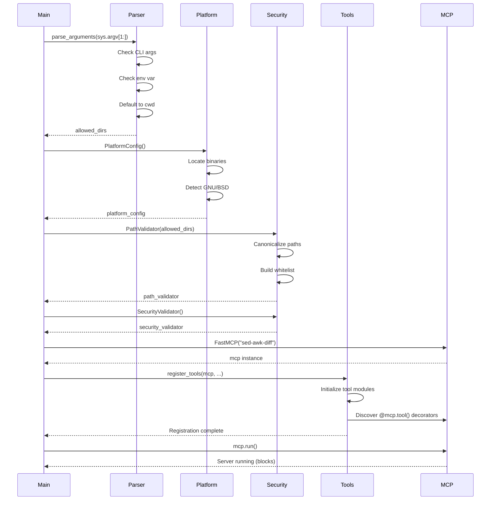
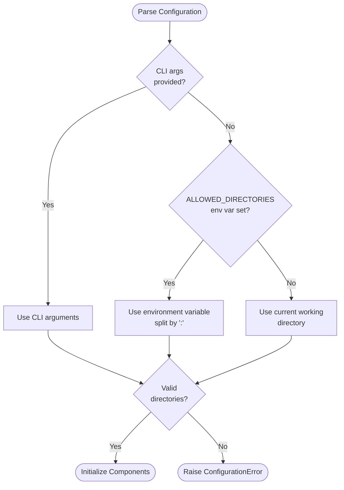
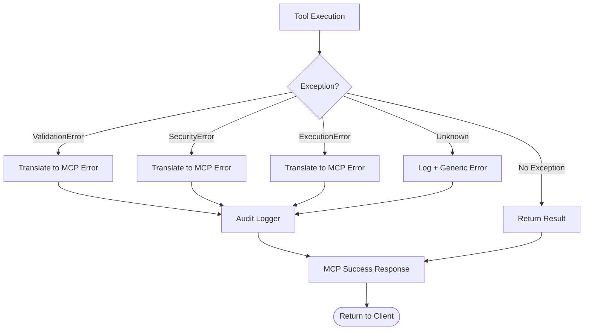

Created: 2025 December 10

# Domain Design: Server

## Document Information

**Document ID:** design-0004-domain_server
**Document Type:** Domain Design (Tier 2)
**Parent Design:** [design-0000-master_sed-awk-mcp](<design-0000-master_sed-awk-mcp.md>)
**Status:** Draft
**Version:** 1.0
**Author:** William Watson
**Date:** 2025-12-10

## Table of Contents

1. [Domain Information](<#1.0 domain information>)
2. [Domain Boundaries](<#2.0 domain boundaries>)
3. [Domain Responsibilities](<#3.0 domain responsibilities>)
4. [Domain Components](<#4.0 domain components>)
5. [Domain Interfaces](<#5.0 domain interfaces>)
6. [Domain Patterns](<#6.0 domain patterns>)
7. [Visual Documentation](<#7.0 visual documentation>)
8. [Tier 3 Components](<#8.0 tier 3 components>)

---

## 1.0 Domain Information

**Domain Name:** Server Domain

**Domain Purpose:** Provide FastMCP server infrastructure including CLI argument parsing, initialization, tool registration, and MCP protocol handling.

**Domain Scope:** Application entry point, configuration management, server lifecycle, and MCP protocol integration.

**Key Principle:** Thin orchestration layer delegating to specialized domains.

[Return to Table of Contents](<#table of contents>)

---

## 2.0 Domain Boundaries

### 2.1 In Scope

- CLI argument parsing (sys.argv)
- Environment variable handling
- FastMCP server initialization
- Tool registration and decoration
- Exception translation to MCP errors
- Server lifecycle (startup, shutdown)
- Configuration validation

### 2.2 Out of Scope

- Tool implementation (Tools Domain)
- Security enforcement (Security Domain)
- Binary execution (Platform Domain)
- MCP protocol implementation (FastMCP library)

### 2.3 Domain Dependencies

**Depends on:**
- FastMCP library: `FastMCP`, `Context`
- Security Domain: `PathValidator`
- Platform Domain: `PlatformConfig`
- Tools Domain: All tool functions
- Python standard library: `sys`, `os`, `logging`

**Used by:**
- None (entry point)

[Return to Table of Contents](<#table of contents>)

---

## 3.0 Domain Responsibilities

### 3.1 Configuration Management

- Parse command-line arguments (`sys.argv[1:]`)
- Read environment variables (`ALLOWED_DIRECTORIES`)
- Establish configuration priority: CLI → ENV → Default
- Validate configuration completeness

### 3.2 Initialization

- Initialize PlatformConfig (binary detection)
- Initialize PathValidator (whitelist setup)
- Initialize SecurityValidator
- Initialize AuditLogger
- Register all tools with FastMCP

### 3.3 Server Lifecycle

- Start FastMCP server
- Handle graceful shutdown
- Clean up resources
- Log server events

### 3.4 Error Handling

- Catch domain exceptions
- Translate to MCP error responses
- Log errors appropriately
- Provide actionable error messages

[Return to Table of Contents](<#table of contents>)

---

## 4.0 Domain Components

### 4.1 Main Entry Point

**Purpose:** Application entry point with CLI parsing.

**Implementation:**
```python
def main():
    """Entry point for sed-awk-diff MCP server."""
    # Parse CLI arguments
    allowed_dirs = parse_arguments(sys.argv[1:])
    
    # Initialize components
    platform_config = PlatformConfig()
    path_validator = PathValidator(allowed_dirs)
    security_validator = SecurityValidator()
    audit_logger = AuditLogger()
    
    # Create FastMCP server
    mcp = FastMCP("sed-awk-diff")
    
    # Register tools
    register_tools(mcp, platform_config, path_validator, 
                   security_validator, audit_logger)
    
    # Run server
    mcp.run()
```

### 4.2 Configuration Parser

**Purpose:** Parse and validate configuration from multiple sources.

**Implementation:**
```python
def parse_arguments(args: List[str]) -> List[str]:
    """Parse CLI arguments and environment variables.
    
    Priority:
    1. Command-line arguments: args list
    2. Environment variable: ALLOWED_DIRECTORIES (colon-separated)
    3. Default: Current working directory
    
    Returns:
        List of allowed directory paths
    """
    if args:
        return args
    
    env_dirs = os.environ.get('ALLOWED_DIRECTORIES', '')
    if env_dirs:
        return env_dirs.split(':')
    
    return [os.getcwd()]
```

### 4.3 Tool Registration

**Purpose:** Register all tools with FastMCP server.

**Implementation:**
```python
def register_tools(
    mcp: FastMCP,
    platform_config: PlatformConfig,
    path_validator: PathValidator,
    security_validator: SecurityValidator,
    audit_logger: AuditLogger
):
    """Register all tools with dependency injection."""
    
    # Pass dependencies to tool modules
    tools.sed.initialize(platform_config, path_validator, 
                         security_validator, audit_logger)
    tools.awk.initialize(platform_config, path_validator,
                         security_validator, audit_logger)
    tools.diff.initialize(platform_config, path_validator,
                          audit_logger)
    tools.list.initialize(path_validator)
    
    # FastMCP discovers tools via decorators
```

### 4.4 Error Handler

**Purpose:** Translate domain exceptions to MCP errors.

**Implementation:**
```python
@mcp.error_handler
async def handle_error(error: Exception) -> Dict[str, Any]:
    """Translate domain exceptions to MCP error responses."""
    
    if isinstance(error, ValidationError):
        return {
            "error": "validation_error",
            "message": str(error),
            "code": "INVALID_INPUT"
        }
    elif isinstance(error, SecurityError):
        return {
            "error": "security_error",
            "message": str(error),
            "code": "ACCESS_DENIED"
        }
    elif isinstance(error, ExecutionError):
        return {
            "error": "execution_error",
            "message": str(error),
            "code": "OPERATION_FAILED"
        }
    else:
        # Unknown error
        audit_logger.log_error("Unhandled exception", error)
        return {
            "error": "internal_error",
            "message": "An unexpected error occurred",
            "code": "INTERNAL_ERROR"
        }
```

[Return to Table of Contents](<#table of contents>)

---

## 5.0 Domain Interfaces

### 5.1 CLI Interface

**Entry Points:**
```bash
# Primary: CLI arguments
python -m sed_awk_mcp.server /path/to/dir1 /path/to/dir2

# Environment variable
export ALLOWED_DIRECTORIES="/path/to/dir1:/path/to/dir2"
python -m sed_awk_mcp.server

# Default: current directory
python -m sed_awk_mcp.server
```

**MCP Configuration:**
```json
{
  "mcpServers": {
    "sed-awk-diff": {
      "command": "python",
      "args": ["-m", "sed_awk_mcp.server", "/path/to/dir1", "/path/to/dir2"]
    }
  }
}
```

### 5.2 Server Interface

**FastMCP Integration:**
```python
# Server creation
mcp = FastMCP("sed-awk-diff")

# Tool registration (via decorators in tool modules)
@mcp.tool()
async def sed_substitute(...):
    ...

# Server execution
mcp.run()  # Blocks until server shutdown
```

### 5.3 Logging Interface

**Log Levels:**
- INFO: Server startup, shutdown, configuration
- WARNING: Non-critical errors, retries
- ERROR: Operation failures, exceptions
- DEBUG: Detailed execution traces (if enabled)

**Log Format:**
```
2025-12-10 10:30:45 INFO server: Starting sed-awk-diff MCP server
2025-12-10 10:30:45 INFO server: Allowed directories: ['/path/to/dir1', '/path/to/dir2']
2025-12-10 10:30:45 INFO server: Platform: GNU sed detected
2025-12-10 10:30:45 INFO server: Server ready
```

[Return to Table of Contents](<#table of contents>)

---

## 6.0 Domain Patterns

### 6.1 Dependency Injection

**Pattern:** Inject dependencies at initialization rather than creation.

**Implementation:**
```python
# Components created once
platform_config = PlatformConfig()
path_validator = PathValidator(allowed_dirs)

# Injected into tools
tools.sed.initialize(platform_config, path_validator, ...)
```

**Rationale:** Testable, flexible, single instance management.

### 6.2 Factory Method

**Pattern:** Centralized component creation.

**Implementation:**
```python
def create_components(allowed_dirs: List[str]) -> Components:
    """Factory for creating all domain components."""
    return Components(
        platform_config=PlatformConfig(),
        path_validator=PathValidator(allowed_dirs),
        security_validator=SecurityValidator(),
        audit_logger=AuditLogger()
    )
```

**Rationale:** Consistent initialization, easy testing.

### 6.3 Facade

**Pattern:** Simplify complex subsystem interactions.

**Implementation:**
- Single `main()` entry point
- Hide initialization complexity
- Delegate to specialized domains
- Present unified server interface

**Rationale:** Simple startup, encapsulated complexity.

### 6.4 Chain of Responsibility

**Pattern:** Error handling through handler chain.

**Implementation:**
```python
# Exception propagates through layers:
Tool → Security/Platform → Server → MCP Error Response
```

**Rationale:** Layered error handling, appropriate translation at each level.

[Return to Table of Contents](<#table of contents>)

---

## 7.0 Visual Documentation

### 7.1 Server Initialization Flow



**Purpose:** Shows server initialization and component setup.

### 7.2 Configuration Priority Diagram



**Purpose:** Shows configuration source priority and validation.

### 7.3 Error Handling Flow



**Purpose:** Shows exception handling and error translation.

**Cross-references:**
- Error Handler: [Section 4.4](<#4.4 error handler>)
- Tool Registration: [Section 4.3](<#4.3 tool registration>)

[Return to Table of Contents](<#table of contents>)

---

## 8.0 Tier 3 Components

This domain will decompose into the following Tier 3 component designs:

1. **[design-0004-component_server_main](<design-0004-component_server_main.md>)** - Entry point and initialization
2. **[design-0004-component_server_config](<design-0004-component_server_config.md>)** - Configuration parsing and validation
3. **[design-0004-component_server_error](<design-0004-component_server_error.md>)** - Error handling and translation

Each component will provide detailed implementation specifications including:
- Complete function implementations
- Configuration parsing logic with priority handling
- Error translation mappings
- Logging specifications
- Unit test requirements
- Integration test scenarios

[Return to Table of Contents](<#table of contents>)

---

## Version History

| Version | Date       | Description           |
| ------- | ---------- | --------------------- |
| 1.0     | 2025-12-10 | Initial domain design |

---

Copyright (c) 2025 William Watson. This work is licensed under the MIT License.
